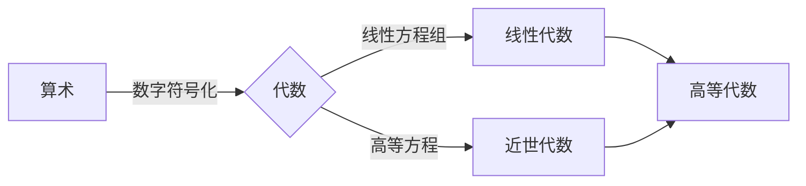

# 高等数学O级课程

[TOC]

# 一、思想准备

## 调整频率

* 与智力无关，与成熟的心智有关。

* 塑造正确的心智：正面思维

  > 吸引力法则：~~替身使者会相互吸引~~ 考虑失败就必定失败，不要怀疑
  >
  > > 例：稻盛和夫《活法》

* 明确目标，并倒推小目标

  > 经济学：未来状态的限制，以未来目标生活的状态限制当前行为

* 持续踏实的向上姿态

  > 跳出负面情绪的方法

  ```java
  安静
  ```

## 享受学习

* 专注

  ```java
  慢跑
  ```

  ```java
  看书
  ```

* 没有完美的计划 ~~敏捷开发~~

  > 方向性
  >
  > > 万事俱备 万事皆休
  >
  > 弹性
  >
  > > ~~debug~~ 试错准备
  >
  > 阶段评估

  ```java
  做一个直面现实、重视平衡的理想主义者
  ```

* 积极

  > 积分思维：复杂问题分解成无数简单问题

  > ~~“匠气”~~ 

* 练习

  ```java
  重视宏观脉络 重视动手实践
  ```

  > 例：《把时间当成朋友》

# 二、学习历史

```高等数学的技术性难度远低于初等数学(立体几何、解析几何)```

* 高等数学思想

  > 用高等数学的思想去更简单的解决问题

  > 难度在于领悟更高阶的思想

  ```目标：塑造高等思维能力```

```数学：对现实问题进行抽象，并回到现实解决现实问题```

* 代数



* 几何

  ```mermaid
  graph LR;
  几何学-->平面几何-->欧几里德几何
  平面几何-->非欧几何-->黎曼几何
  非欧几何-->微分几何
  几何学-->立体几何
  几何学--引进坐标-->解析几何--动态-->微积分<-->微分几何
  三角学--复数&欧拉公式-->三角代数化
  ```

  > 《几何原本》

* 概率论

  ```起源：数学家们生活所迫，为权贵研究如何成为赌怪```

  ```mermaid
  graph LR;
  赌博--事件化-->古典概率论--事件变量化-->概率论
  概率论-->八大分布
  八大分布-->01分布
  八大分布-->二项分布
  八大分布-->泊松分布
  八大分布-->几何分布
  八大分布-->超几何分布
  八大分布-->均匀分布
  八大分布-->指数分布
  八大分布-->正态分布
  概率论-->数理统计
  微积分-->概率论
  ```

  > 事件变量化：在事件中引入随机变量+函数

  ```mermaid
  graph TD;
  数字特征-->期望
  数字特征-->方差
  数字特征-->协方差
  数字特征-->相关系数
  ```

## 函数

### 函数的定义域及求函数表达式

```$f(x)$```

是一种映射关系，从实数集（或其子集）X到实数集Y的映射通常称为定义在X上的函数

```函：中国古代指盒子```

```函数：给一个自变量，进入“盒子”，出来一个因变量```

* #### 组成：

  * 对应规则
  * 定义域

  ```相同函数的对应关系和定义域均需相同```

  > 例（定义域）：$f(x)=\lg x^2$ 和$g(x)=2\lg x$是否相同？
  >
  > 解（定义域）：否，$x\in(-\infty,0)\bigcup(0,+\infty)和x\in(0,+\infty)$

  > 例（对应关系）：$f(x)=x$和$g(x)=\sqrt x^2$s是否相同？
  >
  > 解（对应关系）：否，$g(x)=\sqrt x^2=｜x｜= \begin{cases}-x,& x<0\\x,& x>0 \end{cases} $

* #### 常见规则：

  * 分式中分母不为零

  * 偶次方根内必须大于等于零

  * 对数的真数必须大于零

  * 反三角函数：

    $y = \arcsin(x)$与$y = \arccos(x)$的定义域必须为$-1\leq x\leq1$

  * 三角函数：

    $y=\tan(x)$的定义域$x\neq kπ + π/2$

    $y=\cot(x)$的定义域$x\neq kπ,k为整数$

    > 例1：求$y = sin\sqrt{x}$的定义域
    >
    > 解1：$D= \{ x|x\geq0 \}$

    > 例2：求$y = \tan(x+1)$的定义域
    >
    > 解2：$D=\{x|x\neq kπ+π/2-1,k=0,\pm1,\cdots \}$

    > 例3：求y = arcsin(x-3)的定义域
    >
    > 解3：$D=\{x|2\leq x\leq4\}$

    > 例4：求$y=\frac{1}{1-x^2}+\sqrt{x+1})$的定义域
    >
    > 解4：$x\in(-1,1)\bigcup(1,+\infty)$

    > 例5：已知$f(x)$的定义域为$D=\{0,1\}$，求$f(x^2)$的定义域
    >
    > 解5：$D=[-1,1]$

    > 例6：在例5的函数中，$f(x+a)$其中$a>0$，求$f(x+a)$的定义域
    >
    > 解6：$D=\{x|-a\leq x\leq 1-a,a>0\}$

    > 例7：$f(x)=\lg x^2$ 和$g(x)=2\lg x$是否为同一函数？
    >
    > 解7：相同函数的对应关系和<u>定义域</u>均需相同$x\in(-\infty,0)\bigcup(0,+\infty)\text和x\in(0,+\infty)$

### 函数的抽象态

* #### 思路：正向

  > 例：已知函数$f(x)=x^2+1$,求$f(x^2-1)$的表达式
  >
  > 解：
  >
  > $\because f(x^2-1)=(x^2-1)+1$
  >
  > ​					  $= x^4-2x^2+1+1$
  >
  > $\therefore f(x^2-1)=x^4-2x^2+2$

* #### 思路：逆向

  > 例：已知表达式$f(x+\frac{1}{x})=x^2+\frac{1}{x^2}$,求原函数$f(x)$
  >
  > 解：
  >
  > 设$t=x+\frac{1}{x}$
  >
  > $\because f(x+\frac{1}{x})=x^2+\frac{1}{x^2}$
  >
  > $\therefore f(t)=t^2-2$
  >
  > > 函数内的字母无论是t还是x，只要定义域和数值域相同，就是同一函数
  >
  > $\therefore f(x)=x^2-2$

*   #### 思路：由未知到已知

  >例：已知$f[\sin(\frac{x}{2})]=1+\cos x$，求$f(\cos x)$的表达式
  >
  >解：
  >
  >根据三角函数的特性可知$\cos x=\sin(\pi/2-x)$
  >
  >$\because f(\cos x)=f[\sin(\frac{\pi}{2}-x)]$
  >
  >$\therefore f(\cos x)=f\{sin[\frac{\pi-2x}{2}]\}$
  >
  >将$\pi-2x$替换为$x$，根据已知三角函数转换规则
  >
  >$\therefore f(\cos x)=1+\cos(\pi-2x)$
  >
  >$\therefore f(\cos x)=1-\cos2x$
  >
  >$\therefore f(\cos x)=2sin^2$
  
* #### 思路：由已知到未知

  > 例：已知$f[\sin(\frac{x}{2})]=1+\cos x$，求$f(\cos x)$的表达式
  >
  > 解：
  >
  > 降阶后并根据$\sin^2x+\cos^2=1$可得：
  >
  > $\therefore f[\sin(\frac{x}{2})]=2\cos^2(\frac{x}{2})=2[1-\sin^2(\frac{x}{2})]$
  >
  > 将$\sin \frac{x}{2}$设为$t$,可得
  >
  > $\therefore f(t)=2(1-t^2)$
  >
  > $\therefore f(x)=2(1-x^2)$
  >
  > 将x广义为$\cos x$
  >
  > $\therefore f(\cos x)=2(1-\cos^2x)=2sin^2x$

*   #### 思路：反函数

  > 例：已知$f(x)=e^{x^2},f[\varphi(x)]=1-x$，且已知$\varphi(x)\geq0$，求$\varphi(x)$的定义域
  >
  > 解：
  >
  > 将函数广义化为$\varphi(x)$后可得
  >
  > $\therefore f[\varphi(x)]=e^{[\varphi(x)]^2}$
  >
  > $\therefore 1-x=e^{[\varphi(x)]^2}$
  >
  > 根据**$\ln$和$e$互为反函数**可得：
  >
  > $\therefore\ln(1-x)=[\varphi(x)]^2$
  >
  > $\therefore \varphi(x)=\pm\sqrt{\ln(1-x)}$
  >
  > 又根据题目已知$\because \varphi(x)\geq0$
  >
  > $\therefore\varphi(x)=\sqrt{\ln(1-x)}$ 
  >
  > $\therefore \begin{cases}\ln(1-x)\geq0\\1-x>0\end{cases}$
  >
  > $\because \ln1=0$
  >
  > $\therefore \begin{cases}x\leq0\\x<1\end{cases}$
  >
  > 复合后得$\therefore x\leq0$

* #### 思路：换元

  ```函数的变量不影响函数的对应关系```
  
  > 例：已知$af(x)+bf(\frac{1}{x})=\frac{c}{x}$，且$|a|\neq|b|$，证明$f(x)$为奇函数
  >
  > 解：
  >
  > 根据奇函数可知需求证：$f(x)=-f(-x)$
  >
  > 令$t=\frac{1}{x}$得$af(\frac{1}{t})+bf(t)=ct$
  >
  > $\therefore af(\frac{1}{x})+bf(x)=cx\tag{2}$
  >
  > 令$(1)\times a$得$a^2f(x)+abf(\frac{1}{x})=\frac{ac}{x}\tag{3}$
  >
  > 令$(2)\times b$得$abf(\frac{1}{x})+b^2f(x)=bcx\tag{4}$
  >
  > $(3)-(4)$可得：$\begin{align*}a^2f(x)-b^2f(x)&=\frac{ac}{x}-bcx\\(a^2-b^2)f(x)&=\frac{ac-bcx^2}{x}\end{align*}$
  >
  >  又根据$|a|\neq|b|$可知$a^2-b^2\neq0$
  > $\therefore f(x)=\frac{ac-bcx^2}{(a^2-b^2)x}$   
  >
  >  代入$-x$可得：$f(x)=\frac{ac-bcx^2}{-(a^2-b^2)x}=-f(x)$
  >
  > $\therefore f(x)$为奇函数

### 反函数及函数复合方法

​	存在两个函数值对应同一个因变量，但不存在一个函数值对应两个因变量。```函数必须有明确的对应关系```

* #### 反函数

  $\begin{cases}y=f(x)\\x=f^{-1}(y)\end{cases}$互为反函数，且图像相同

  ```反函数的定义域=原函数的值域```

  $\begin{cases}y=f(x)\\y=f^{-1}(x)\end{cases}$图像关于$y=x$对称

  > 例1：求函数$y=\frac{2^x}{2^x+1}$的反函数及其定义域
  >
  > 解1：
  >
  > $\because y=\frac{2^x}{2^x+1}$
  >
  > $\therefore 2^xy+y=2^2$
  >
  > $\therefore y=2^x(1-y)$
  >
  > $\therefore 2^x=\frac{y}{1-y}$
  >
  > $\therefore x=\log_2(\frac{y}{1-y})$
  >
  > $\therefore$取得反函数的对应规则$y=log_2[\frac{x}{1-x}]$

  ```可以求反函数的定义域```

  > $\therefore \begin{cases}\frac{x}{1-x}>0\\1-x\neq0\end{cases}$
  >
  > $\therefore0<x<1$

  ```也可以求原函数的值域```

  > 原函数未限制定义域，既$x\in(-\infty,+\infty)$
  >
  > 将$+\infty$代入原函数可得
  >
  > $\therefore\lim_{x \to +\infty}\frac{2^x}{2^x+1}=1$
  >
  > 将$-\infty$代入原函数可得
  >
  > $\therefore \lim_{x \to -\infty}\frac{2^x}{2^x+1}=0$
  >
  > $\therefore 0<y<1$转换为反函数为$0<x<1$

* #### 分段函数

  > 例1：求$y=f(x)=\begin{cases}x,&-\infty<x<1\\x^2,&1\leq x\leq4\\2^x,&4<x<+\infty\end{cases}$的反函数
  >
  > 解1：分段求解
  >
  > （1）$y=f^{-1}(x)=x,(-\infty<x<1)$
  >
  > （2）$y=f^{-1}(x)=\sqrt{x},(1\leq x\leq16)$
  >
  > （3）$y=f^{-1}(x)=\log_2x,(16<x<+\infty)$
  >
  > $\therefore y=f^{-1}(x)=\begin{cases}x,&-\infty<x<1\\\sqrt{x},&1\leq x\leq16\\\log_2x,&16<x<+\infty\end{cases}$

  > 例2：求$y=f(x)=\begin{cases}1+x^2,&x>0\\0,&x=0\\-1-x^2,&x<0\end{cases}$的反函数
  >
  > 解2：分段求解
  >
  > （1）当$x>0$时：$y=f^{-1}(x)=\sqrt{x-1},(x>1)$
  >
  > （2）当$x=0$时：$y=0$
  >
  > （3）当$x<0$时：$y=f^{-1}(x)=-\sqrt{-1-x},(x<-1)$
  >
  > $\therefore y=f^{-1}(x)=\begin{cases}\sqrt{x-1},&x>1\\0,&x=0\\-\sqrt{1-x},&x<-1\end{cases}$

  > 例3：求$y=\frac{x+2}{x-2}$的反函数
  >
  > 解3：根据原函数可得$y=f^{-1}(x)=\frac{2+2x}{x-1}$，自然定义域为$x\neq1$

* #### 复合函数

  函数$g$与函数$f$构成的复合函数，若按“先$g$后$f$”的次序复合，通常记为$(f\circ g)(x)$即$(f\circ g)(x)=f[g(x)]$
  
  > 例1：存在函数
  > $$
  > \begin{equation}f(x)=\begin{cases}1,&|x|<1\\0,&|x|=1\\-1,&|x|>1\end{cases}\label{eq:tiaojian1}\end{equation}
  > $$
  > 和$g(x)=e^x$,求$f[g(x)]$的反函数$g[f(x)]$
  > $$
  > e=\lim_{n\to+\infty}(1+\frac{1}{n})^n,\text{e等于2.71828183...，是自然常数、无限不循环小数、超越数}
  > $$
  > 解1：将$g(x)$套入$f(x)$可得$f[g(x)]=\begin{cases}1,&e^x<1\\0,&e^x=1\\-1,&e^x>1\end{cases}$
  >
  > $\because e^x<1=e^0$ 和 $e^x>1=e^0$
  >
  > $\therefore x<0$ 和 $x>0$
  >
  > $\therefore f[g(x)]=\begin{cases}1,&x<0\\0,&x=0\\-1,&x>0\end{cases}$
  >
  > 将$f(x)$代入$g(x)=e^x$得$g(f(x))=e^{f(x)}$，结合$\eqref{eq:tiaojian1}$可知$g[f(x)]=\begin{cases}e,& |x|<1\\1,&|x|=0\\e^{-1},&|x|>1\end{cases}$
  
  > 例2：存在函数$f(x)=\begin{cases}\sqrt{x},&0\leq x<4\\x,&4\leq x<6\end{cases}$ 和 $g(x)=\begin{cases}x^2,&0\leq x<2\\2+x,&2\leq x\leq4\end{cases}$
  >
  > 解2：同时考虑$f(x)$和$g(x)$的定义域，匹配四种情况讨论
  >
  > ```太麻烦了，略```
### 奇偶性、单调性、周期性

```有界性```，在极限部分补充

* #### 奇偶性

  * 偶函数

    存在$f(x),x\in D$ 在其定义域内$f(-x)=f(x)$

    函数图像关于$y轴$对称

  * 奇函数

    存在$f(x),x\in D$ 在其定义域内$f(-x)=-f(x)$

    函数图像关于$原点$对称，既$f(0)=0$

    > 例（判断有限函数的奇偶性）：$\forall y=3x^2-x^3$，判断其奇偶性
    >
    > 解（判断有限函数的奇偶行）：
    >
    > $y=3x^2$为偶函数，$y=x^3$为奇函数
    >
    > $\because 3x^2+x^3\neq\pm f(x)$
    >
    > $\therefore y=3x^2-x^3$ 为非奇非偶函数

    根据类似例题可得：

    ```奇函数+奇函数=奇函数```，```奇函数×奇函数=偶函数```

    ```偶函数+偶函数=偶函数```，```偶函数×偶函数=偶函数```

    ```奇函数+偶函数=非奇非偶函数```，```奇函数×偶函数=奇函数```

  * 非奇非偶函数

    ```所有函数均能拆分成奇函数+偶函数```

    $f(x)=\frac{1}{2}[\frac{f(x)+f(-x)}{偶函数}+\frac{f(x)-f(-x)}{奇函数}]$

    > 例（判断复合函数的奇偶性）：在区间$(-\infty,+\infty)$上，$\forall f(x)$，$g(x)$，判断$f[g(x)]$和$g[f(x)]$的奇偶性
    >
    > 解（判断复合函数的奇偶性）：
    >
    > $f(x),g(x)$奇偶性不同时，代入可得$f[g(x)],g[f(x)]$为偶函数
    >
    > $f(x),g(x)$同为奇函数时，代入可得$f[g(x)],g[f(x)]$为奇函数
    >
    > $f(x),g(x)$同为偶函数时，代入可得$f[g(x)],g[f(x)]$为偶函数

    > 例1：判断函数$f(x)=\frac{a^x-1}{a^x+1}，a\neq1\and a>0$ 的奇偶性
    > 解1：
    >
    > $\because f(-x)=\frac{a^{-x}-1}{a^{-x}+1}\\$
    >
    > 上下同乘$a^x$可得：$f(-x)=\frac{1-a^x}{1+a^x}=\frac{-(a^x-1)}{a^x+1}$
    >
    > $\therefore f(-x)=-f(x)$，函数为奇函数
    
    >例2：判断函数$f(x)=\lg\frac{1-x}{1+x}$的奇偶性
    >
    >解2：
    >
    >$\because f(x)=\lg\frac{1-x}{1+x}=\lg{(1-x)}-\lg{(1+x)}$
    >
    >$\because f(-x)=\lg{\frac{1+x}{1-x}}=lg{(1+x)}-lg{(1-x)}=-[\lg{(1-x)}-\lg(1+x)]$
    >
    >$\therefore f(-x)=-f(x)$，函数为奇函数
    
    $$
    对数运算规则：\\[2ex]
    a^{log_a{b}}=b\\[2ex]
    \log_a{a^b}=b\\[2ex]
    \log_a{m^n}=n\log_a{m}\\[2ex]
    \log_a^n{m}=\frac{1}{n\log_a{m}}\\[2ex]
    \log_a{(mn)}=\log_a{m}+\log_a{n}\\[2ex]
    \log_a{(m\div n)}=\log_a{m}-\log_a{n}\\[2ex]
    $$
    
    > 例3：$\exists f(x)=|x\sin{x}|e^{\cos{x}},\and-\infty\leq x\leq\infty$
    >
    > ​          A. 有界 		   			B.单调
    >
    > ​		  C.周期						 D.偶函数
    >
    > 解3：
    >
    > D，偶函数$\times$偶函数=偶函数

* #### 单调性

   存在函数$f(x)$在区间[a,b]内有定义，$\forall x_1,x_2\in[a,b]$，当$x_1<x_2$时

  若$f(x_1)<f(x_2)$，称为“单增”

  若$f(x_1)<f(x_2)$，称为“单减”

  ##### 其他特殊单调性：

  “凹增” 

  “凹减”

  

  <svg xmlns="http://www.w3.org/2000/svg" xmlns:xlink="http://www.w3.org/1999/xlink" width="480" height="223pt" viewBox="0 0 360 223">     <defs>         <symbol overflow="visible" id="a">             <path d="M5.29-2.191H.55v-.82h4.74zm0 0"/>         </symbol>         <symbol overflow="visible" id="b">             <path d="M3.234 0v-1.715H.125v-.805l3.27-4.636h.714v4.636h.97v.805h-.97V0zm0-2.52v-3.226L.992-2.52zm0 0"/>         </symbol>         <symbol overflow="visible" id="c">             <path d="M5.035-.844V0H.305a1.54 1.54 0 01.101-.61c.121-.324.313-.64.578-.953.266-.312.649-.671 1.149-1.085.777-.637 1.304-1.141 1.578-1.516.273-.371.41-.723.41-1.055 0-.347-.125-.644-.375-.883-.246-.238-.574-.359-.973-.359-.421 0-.761.129-1.015.383-.254.254-.383.605-.387 1.055L.47-5.117c.062-.672.293-1.188.699-1.54.402-.355.945-.53 1.625-.53.687 0 1.23.19 1.629.57.402.383.601.855.601 1.418 0 .285-.058.566-.175.844-.118.277-.313.566-.582.875-.274.304-.723.726-1.356 1.257-.527.442-.867.743-1.015.903a2.868 2.868 0 00-.372.476zm0 0"/>         </symbol>         <symbol overflow="visible" id="d">             <path d="M3.727 0h-.88v-5.602c-.21.204-.488.407-.831.606a5.902 5.902 0 01-.926.457v-.852c.492-.23.922-.511 1.289-.84.367-.328.629-.648.781-.957h.567zm0 0"/>         </symbol>         <symbol overflow="visible" id="e">             <path d="M.906 0v-1H1.91v1zm0 0"/>         </symbol>         <symbol overflow="visible" id="f">             <path d="M.414-3.531c0-.844.09-1.528.262-2.043.176-.516.433-.914.777-1.192.344-.28.774-.421 1.297-.421.383 0 .719.078 1.008.23.289.156.531.379.719.672.187.289.335.644.445 1.062.11.418.16.985.16 1.692 0 .84-.086 1.52-.258 2.035-.172.516-.43.914-.773 1.195-.344.281-.778.422-1.301.422-.691 0-1.234-.246-1.625-.742-.473-.594-.71-1.567-.71-2.91zm.906 0c0 1.176.137 1.957.41 2.347.278.387.614.582 1.02.582.402 0 .742-.195 1.016-.586.277-.39.414-1.171.414-2.343 0-1.18-.137-1.961-.414-2.348-.274-.387-.618-.582-1.028-.582-.402 0-.726.172-.965.516-.304.433-.453 1.238-.453 2.414zm0 0"/>         </symbol>         <symbol overflow="visible" id="g">             <path d="M.414-1.875l.922-.078c.07.45.23.785.476 1.012.25.226.551.34.903.34.422 0 .781-.16 1.074-.477.293-.32.438-.742.438-1.27 0-.504-.141-.898-.422-1.187-.282-.29-.649-.434-1.106-.434a1.526 1.526 0 00-1.3.692L.57-3.383l.696-3.68h3.558v.844H1.97l-.387 1.922c.43-.3.879-.45 1.352-.45a2.14 2.14 0 011.582.65c.43.433.644.992.644 1.671 0 .649-.187 1.207-.566 1.68-.457.578-1.086.867-1.88.867-.651 0-1.183-.18-1.593-.547-.41-.363-.648-.847-.707-1.449zm0 0"/>         </symbol>     </defs>     <path d="M7.66 35.668l5.371 8.715 5.367 9.754L23.77 64.78l5.37 11.371 5.372 11.914 5.367 12.274L50.62 125.2l5.371 12.198 5.367 11.786 5.371 11.195 5.372 10.426 5.367 9.492 5.37 8.414 5.372 7.203 5.371 5.883 5.367 4.465 5.371 2.98 5.371 1.453 5.368-.105 5.37-1.656 5.372-3.18 5.37-4.66 5.368-6.063 5.371-7.37 5.371-8.567 5.367-9.625 5.372-10.535 5.37-11.286 5.372-11.851 10.738-24.668 5.371-12.434 5.367-12.234 5.371-11.856 5.371-11.28 5.372-10.536 5.367-9.629 5.37-8.566 5.372-7.371 5.367-6.063 5.371-4.656 5.371-3.184 5.371-1.652 5.368-.105 5.37 1.449 5.372 2.984 5.367 4.465 5.371 5.879 5.371 7.203 5.371 8.418 5.367 9.492 5.372 10.426 5.37 11.191 10.739 23.985 5.371 12.418 5.371 12.441 5.367 12.277 5.371 11.914 5.371 11.368 5.372 10.644 5.367 9.758 5.37 8.715" fill="none" stroke-width="1.6" stroke-linecap="square" stroke="#5e81b5" stroke-miterlimit="3.25"/>     <path d="M7.66 111.129v-4" fill="none" stroke-width=".2" stroke="#666" stroke-miterlimit="3.25"/>     <use xlink:href="#a" x="1.66" y="123.128" fill="#666"/>     <use xlink:href="#b" x="7.66" y="123.128" fill="#666"/>     <path d="M29.14 111.129v-2.402M50.621 111.129v-2.402M72.102 111.129v-2.402M93.578 111.129v-4" fill="none" stroke-width=".2" stroke="#666" stroke-miterlimit="3.25"/>     <use xlink:href="#a" x="87.58" y="123.128" fill="#666"/>     <use xlink:href="#c" x="93.58" y="123.128" fill="#666"/>     <path d="M115.059 111.129v-2.402M136.54 111.129v-2.402M158.02 111.129v-2.402M179.5 111.129v-4M200.98 111.129v-2.402M222.46 111.129v-2.402M243.941 111.129v-2.402M265.422 111.129v-4" fill="none" stroke-width=".2" stroke="#666" stroke-miterlimit="3.25"/>     <use xlink:href="#c" x="262.42" y="123.128" fill="#666"/>     <path d="M286.898 111.129v-2.402M308.379 111.129v-2.402M329.86 111.129v-2.402M351.34 111.129v-4" fill="none" stroke-width=".2" stroke="#666" stroke-miterlimit="3.25"/>     <use xlink:href="#b" x="348.34" y="123.128" fill="#666"/>     <path d="M.5 111.129h358M179.5 220.813h2.398M179.5 210.84h4" fill="none" stroke-width=".2" stroke="#666" stroke-miterlimit="3.25"/>     <use xlink:href="#a" x="156.5" y="213.34" fill="#666"/>     <g fill="#666">         <use xlink:href="#d" x="162.5" y="213.34"/>         <use xlink:href="#e" x="168.062" y="213.34"/>         <use xlink:href="#f" x="170.84" y="213.34"/>     </g>     <path d="M179.5 200.867h2.398M179.5 190.898h2.398M179.5 180.926h2.398M179.5 170.957h2.398M179.5 160.984h4" fill="none" stroke-width=".2" stroke="#666" stroke-miterlimit="3.25"/>     <use xlink:href="#a" x="156.5" y="163.484" fill="#666"/>     <g fill="#666">         <use xlink:href="#f" x="162.5" y="163.484"/>         <use xlink:href="#e" x="168.062" y="163.484"/>         <use xlink:href="#g" x="170.84" y="163.484"/>     </g>     <path d="M179.5 151.012h2.398M179.5 141.043h2.398M179.5 131.07h2.398M179.5 121.098h2.398M179.5 111.129h4M179.5 101.156h2.398M179.5 91.188h2.398M179.5 81.215h2.398M179.5 71.242h2.398M179.5 61.273h4" fill="none" stroke-width=".2" stroke="#666" stroke-miterlimit="3.25"/>     <g fill="#666">         <use xlink:href="#f" x="162.5" y="63.772"/>         <use xlink:href="#e" x="168.062" y="63.772"/>         <use xlink:href="#g" x="170.84" y="63.772"/>     </g>     <path d="M179.5 51.3h2.398M179.5 41.328h2.398M179.5 31.36h2.398M179.5 21.387h2.398M179.5 11.418h4" fill="none" stroke-width=".2" stroke="#666" stroke-miterlimit="3.25"/>     <g fill="#666">         <use xlink:href="#d" x="162.5" y="13.916"/>         <use xlink:href="#e" x="168.062" y="13.916"/>         <use xlink:href="#f" x="170.84" y="13.916"/>     </g>     <path d="M179.5 1.445h2.398M179.5 221.758V.5" fill="none" stroke-width=".2" stroke="#666" stroke-miterlimit="3.25"/> </svg>
  
  > 例1：$\exist f(x)和\varphi(x)$均为单减函数，求$f(\varphi(x))$的单调性
  >
  > 解1：
  >
  > 根据$f(x)$和$\varphi(x)$的单调性可知：
  >
  > 假设存在$x_1<x_2$，则有$\varphi(x_1)$>$\varphi(x_2)$
  >
  > $\therefore f[\varphi(x_1)]<f[\varphi(x_2)]$
  >
  > 可知复合函数$f[\varphi(x)]$为单调增函数
  
  #### 附：在 Markdown 中绘制函数图像  ####

​			使用 `SVG` 首先用 Mathematica 绘图并导出SVG

 			```Plot[Sin[x], {x, -4, 4}, PlotPoints -> 2] Export["sin.svg", %] ``` 

​			接下来使用 [svgo](https://github.com/svg/svgo) 做一下压缩

 			```sh svgo --pretty sin.svg ```

* #### 周期性

  设函数$f(x)$的定义域为$D$，如果存在一个正数$l$，使得对于任一$x\in D$有$(x\pm l)\in D$，且$f(x+l)=f(x)$恒成立，则称$f(x)$为周期函数，$l$称为$f(x)$的周期，通常我们说周期函数的周期是指最小正周期。

  如：三角函数，周期为2$\pi $、$ \pi$，$f(x+T)=f(x)$周期为T

  
  
  > 例1：已知$f(x)$的周期为T，求$f(ax+b)$的周期
>
  > 解1：$\frac{T}{|a|}$

  ```注1：周期均为正数```
  
  > 例2：已知$f(x)$和$g(x)$的周期为T，求$f(x)\pm g(x)$的周期
>
  > 解2：T

  ```注2:相同周期函数加减后，周期仍为原周期```
  
  > 例3：已知$f(x)$和$g(x)$的周期分别为$T_1$$T_2$，求两函数运算后的周期
>
  > 解3：$T_1T_2$的最小公倍数

  ```注3:不同周期函数运算后，周期为两函数周期的最小公倍数```
  
  > 例4：求$f(x)=|sinx|$的周期
>
  > 解4：根据诱导公式$f(x)=|sin(x+\pi)|=｜-sinx｜=|sinx|$，所以函数周期为$ \pi$
  
  > 例5：以下哪个函数有周期性
  >
  > ​		  A.$x\sin2x$	B.$cosx^2$	C.$x-\sin^2x$	D.$\cos^2x$
>
  > 解5：D，$\cos^2x=\frac{1+cos2x}{2}$

  ```注4：常数具有周期性```

  ```注5：周期性函数和非周期性函数运算后为非周期性函数```
  
  ```
  注重数形结合
  ```

### 指数函数、对数函数、幂函数

* #### 指数函数

  $y=a^x(a>0且a\neq1)$，a为固定实数

  ```x为0时，无论a为多少，y等于1```

  ```a为0时函数无意义```

  运算法则：

  * $a^x\cdot a^y=a^{x+y}$
  * $(a^x)^y=a^{xy}$
  * $(ab)^x=a^xb^x$
  * $(\frac{a}{b})^x=\frac{a^x}{b^x}$
  * $a^{-x}=\frac{1}{a^x}$
  * $a^{\frac{m}{n}}=\sqrt[n]{a^m}$

  $$
  e,欧拉数\\[2ex]e\approx2.718281
  $$

  反函数：

  $$\begin{array}{c|lcr}
  \text{原函数} & \text{反函数} \\
  \hline
  y=a^x & y=\log_a{x}  \\
  y=e^x & y=\ln{x} \\
  \end{array}$$

  ​	```指数函数恒为正```

  ​	```指数为0的函数值均为1```

  <!DOCTYPE svg PUBLIC "-//W3C//DTD SVG 1.1//EN" "http://www.w3.org/Graphics/SVG/1.1/DTD/svg11.dtd"><svg xmlns="http://www.w3.org/2000/svg" viewBox="0 0 650 400" version="1.1"><clipPath id="box"><rect x="0" y="0" width="650" height="400" style="fill:none;stroke:none;" /></clipPath><g clip-path="url(#box)"><rect x="0.00" y="0.00" width="650.00" height="400.00" style="fill:#FFFFFF;stroke:none;" /><path d="M0.00 400.00 L650.00 400.00 M0.00 350.00 L650.00 350.00 M0.00 300.00 L650.00 300.00 M0.00 250.00 L650.00 250.00 M0.00 200.00 L650.00 200.00 M0.00 150.00 L650.00 150.00 M0.00 100.00 L650.00 100.00 M0.00 50.00 L650.00 50.00 M0.00 0.00 L650.00 0.00 M25.00 0.00 L25.00 400.00 M75.00 0.00 L75.00 400.00 M125.00 0.00 L125.00 400.00 M175.00 0.00 L175.00 400.00 M225.00 0.00 L225.00 400.00 M275.00 0.00 L275.00 400.00 M325.00 0.00 L325.00 400.00 M374.00 0.00 L374.00 400.00 M425.00 0.00 L425.00 400.00 M475.00 0.00 L475.00 400.00 M525.00 0.00 L525.00 400.00 M575.00 0.00 L575.00 400.00 M625.00 0.00 L625.00 400.00 " style="fill:none;stroke:#D0D0D0;stroke-width:1;" /><path d="M325.00 0.00 L325.00 400.00 " style="fill:none;stroke:#000000;stroke-width:1;" /><path d="M318.50 400.00 L331.50 400.00 M318.50 350.00 L331.50 350.00 M318.50 300.00 L331.50 300.00 M318.50 250.00 L331.50 250.00 M318.50 200.00 L331.50 200.00 M318.50 150.00 L331.50 150.00 M318.50 100.00 L331.50 100.00 M318.50 50.00 L331.50 50.00 M318.50 0.00 L331.50 0.00 " style="fill:none;stroke:#000000;stroke-width:1;" /><path d="M0.00 200.00 L650.00 200.00 " style="fill:none;stroke:#000000;stroke-width:1;" /><path d="M-25.00 193.50 L-25.00 206.50 M25.00 193.50 L25.00 206.50 M75.00 193.50 L75.00 206.50 M125.00 193.50 L125.00 206.50 M175.00 193.50 L175.00 206.50 M225.00 193.50 L225.00 206.50 M275.00 193.50 L275.00 206.50 M325.00 193.50 L325.00 206.50 M375.00 193.50 L375.00 206.50 M425.00 193.50 L425.00 206.50 M475.00 193.50 L475.00 206.50 M525.00 193.50 L525.00 206.50 M575.00 193.50 L575.00 206.50 M625.00 193.50 L625.00 206.50 " style="fill:none;stroke:#000000;stroke-width:1;" /><text x="333.125" y="352.5" text-anchor="start" style="font:10px Droid Sans,Trebuchet MS,Arial,Helvetica,sans-serif;stroke:none;fill:#000000">-3</text><text x="333.125" y="302.5" text-anchor="start" style="font:10px Droid Sans,Trebuchet MS,Arial,Helvetica,sans-serif;stroke:none;fill:#000000">-2</text><text x="333.125" y="252.5" text-anchor="start" style="font:10px Droid Sans,Trebuchet MS,Arial,Helvetica,sans-serif;stroke:none;fill:#000000">-1</text><text x="333.125" y="202.5" text-anchor="start" style="font:10px Droid Sans,Trebuchet MS,Arial,Helvetica,sans-serif;stroke:none;fill:#000000">0</text><text x="333.125" y="152.5" text-anchor="start" style="font:10px Droid Sans,Trebuchet MS,Arial,Helvetica,sans-serif;stroke:none;fill:#000000">1</text><text x="333.125" y="102.5" text-anchor="start" style="font:10px Droid Sans,Trebuchet MS,Arial,Helvetica,sans-serif;stroke:none;fill:#000000">2</text><text x="333.125" y="52.5" text-anchor="start" style="font:10px Droid Sans,Trebuchet MS,Arial,Helvetica,sans-serif;stroke:none;fill:#000000">3</text><text x="25" y="216.125" text-anchor="middle" style="font:10px Droid Sans,Trebuchet MS,Arial,Helvetica,sans-serif;stroke:none;fill:#000000">-6</text><text x="75" y="216.125" text-anchor="middle" style="font:10px Droid Sans,Trebuchet MS,Arial,Helvetica,sans-serif;stroke:none;fill:#000000">-5</text><text x="125" y="216.125" text-anchor="middle" style="font:10px Droid Sans,Trebuchet MS,Arial,Helvetica,sans-serif;stroke:none;fill:#000000">-4</text><text x="175" y="216.125" text-anchor="middle" style="font:10px Droid Sans,Trebuchet MS,Arial,Helvetica,sans-serif;stroke:none;fill:#000000">-3</text><text x="225" y="216.125" text-anchor="middle" style="font:10px Droid Sans,Trebuchet MS,Arial,Helvetica,sans-serif;stroke:none;fill:#000000">-2</text><text x="275" y="216.125" text-anchor="middle" style="font:10px Droid Sans,Trebuchet MS,Arial,Helvetica,sans-serif;stroke:none;fill:#000000">-1</text><text x="325" y="216.125" text-anchor="middle" style="font:10px Droid Sans,Trebuchet MS,Arial,Helvetica,sans-serif;stroke:none;fill:#000000">0</text><text x="374.99999999999994" y="216.125" text-anchor="middle" style="font:10px Droid Sans,Trebuchet MS,Arial,Helvetica,sans-serif;stroke:none;fill:#000000">1</text><text x="425" y="216.125" text-anchor="middle" style="font:10px Droid Sans,Trebuchet MS,Arial,Helvetica,sans-serif;stroke:none;fill:#000000">2</text><text x="475" y="216.125" text-anchor="middle" style="font:10px Droid Sans,Trebuchet MS,Arial,Helvetica,sans-serif;stroke:none;fill:#000000">3</text><text x="525" y="216.125" text-anchor="middle" style="font:10px Droid Sans,Trebuchet MS,Arial,Helvetica,sans-serif;stroke:none;fill:#000000">4</text><text x="575" y="216.125" text-anchor="middle" style="font:10px Droid Sans,Trebuchet MS,Arial,Helvetica,sans-serif;stroke:none;fill:#000000">5</text><text x="625" y="216.125" text-anchor="middle" style="font:10px Droid Sans,Trebuchet MS,Arial,Helvetica,sans-serif;stroke:none;fill:#000000">6</text><path d="M-10.00 200.00 L-0.25 199.93 L0.75 199.92 L2.75 199.92 L4.75 199.92 L6.75 199.91 L8.75 199.91 L10.75 199.91 L12.75 199.90 L14.75 199.90 L16.75 199.89 L18.75 199.89 L20.75 199.89 L22.75 199.88 L24.75 199.88 L26.75 199.87 L28.75 199.87 L30.75 199.86 L32.75 199.86 L34.75 199.85 L36.75 199.84 L38.75 199.84 L40.75 199.83 L42.75 199.82 L44.75 199.82 L46.75 199.81 L48.75 199.80 L50.75 199.79 L52.75 199.78 L54.75 199.78 L56.75 199.77 L58.75 199.76 L60.75 199.75 L62.75 199.74 L64.75 199.73 L66.75 199.71 L68.75 199.70 L70.75 199.69 L72.75 199.68 L74.75 199.66 L76.75 199.65 L78.75 199.64 L80.75 199.62 L82.75 199.61 L84.75 199.59 L86.75 199.57 L88.75 199.56 L90.75 199.54 L92.75 199.52 L94.75 199.50 L96.75 199.48 L98.75 199.46 L100.75 199.44 L102.75 199.41 L104.75 199.39 L106.75 199.36 L108.75 199.34 L110.75 199.31 L112.75 199.28 L114.75 199.25 L116.75 199.22 L118.75 199.19 L120.75 199.16 L122.75 199.12 L124.75 199.09 L126.75 199.05 L128.75 199.01 L130.75 198.97 L132.75 198.93 L134.75 198.89 L136.75 198.84 L138.75 198.79 L140.75 198.75 L142.75 198.69 L144.75 198.64 L146.75 198.59 L148.75 198.53 L150.75 198.47 L152.75 198.40 L154.75 198.34 L156.75 198.27 L158.75 198.20 L160.75 198.13 L162.75 198.05 L164.75 197.97 L166.75 197.89 L168.75 197.80 L170.75 197.71 L172.75 197.62 L174.75 197.52 L176.75 197.42 L178.75 197.32 L180.75 197.21 L182.75 197.09 L184.75 196.97 L186.75 196.85 L188.75 196.72 L190.75 196.59 L192.75 196.45 L194.75 196.30 L196.75 196.15 L198.75 196.00 L200.75 195.83 L202.75 195.66 L204.75 195.49 L206.75 195.30 L208.75 195.11 L210.75 194.91 L212.75 194.70 L214.75 194.49 L216.75 194.26 L218.75 194.03 L220.75 193.78 L222.75 193.53 L224.75 193.27 L226.75 192.99 L228.75 192.71 L230.75 192.41 L232.75 192.10 L234.75 191.78 L236.75 191.44 L238.75 191.09 L240.75 190.73 L242.75 190.35 L244.75 189.96 L246.75 189.55 L248.75 189.12 L250.75 188.67 L252.75 188.21 L254.75 187.73 L256.75 187.23 L258.75 186.71 L260.75 186.17 L262.75 185.60 L264.75 185.02 L266.75 184.40 L268.75 183.77 L270.75 183.10 L272.75 182.42 L274.75 181.70 L276.75 180.95 L278.75 180.17 L280.75 179.36 L282.75 178.52 L284.75 177.65 L286.75 176.73 L288.75 175.78 L290.75 174.80 L292.75 173.77 L294.69 172.73 L296.56 171.69 L298.36 170.65 L300.10 169.61 L301.77 168.58 L303.39 167.55 L304.96 166.51 L306.47 165.48 L307.94 164.45 L309.37 163.42 L310.76 162.39 L312.10 161.37 L313.42 160.34 L314.69 159.31 L315.94 158.29 L317.15 157.26 L318.34 156.24 L319.49 155.22 L320.62 154.19 L321.73 153.17 L322.81 152.15 L323.86 151.13 L324.90 150.10 L325.91 149.08 L326.90 148.06 L327.87 147.04 L328.83 146.02 L329.76 145.01 L330.68 143.99 L331.58 142.97 L332.46 141.95 L333.33 140.93 L334.19 139.92 L335.03 138.90 L335.85 137.88 L336.66 136.86 L337.46 135.85 L338.25 134.83 L339.02 133.82 L339.78 132.80 L340.53 131.79 L341.27 130.77 L342.00 129.76 L342.71 128.74 L343.42 127.73 L344.12 126.71 L344.80 125.70 L345.48 124.69 L346.15 123.67 L346.81 122.66 L347.46 121.65 L348.10 120.63 L348.74 119.62 L349.36 118.61 L349.98 117.59 L350.59 116.58 L351.20 115.57 L351.79 114.56 L352.38 113.55 L352.96 112.53 L353.54 111.52 L354.10 110.51 L354.67 109.50 L355.22 108.49 L355.77 107.48 L356.31 106.47 L356.85 105.46 L357.38 104.44 L357.91 103.43 L358.43 102.42 L358.95 101.41 L359.46 100.40 L359.96 99.39 L360.46 98.38 L360.95 97.37 L361.44 96.36 L361.93 95.35 L362.41 94.34 L362.88 93.33 L363.36 92.32 L363.82 91.31 L364.28 90.31 L364.74 89.30 L365.20 88.29 L365.65 87.28 L366.09 86.27 L366.53 85.26 L366.97 84.25 L367.40 83.24 L367.83 82.23 L368.26 81.23 L368.68 80.22 L369.10 79.21 L369.52 78.20 L369.93 77.19 L370.34 76.18 L370.74 75.18 L371.15 74.17 L371.55 73.16 L371.94 72.15 L372.33 71.14 L372.72 70.14 L373.11 69.13 L373.49 68.12 L373.87 67.11 L374.25 66.10 L374.63 65.10 L375.00 64.09 L375.37 63.08 L375.73 62.07 L376.10 61.07 L376.46 60.06 L376.82 59.05 L377.17 58.05 L377.53 57.04 L377.88 56.03 L378.23 55.02 L378.57 54.02 L378.92 53.01 L379.26 52.00 L379.60 51.00 L379.93 49.99 L380.27 48.98 L380.60 47.98 L380.93 46.97 L381.26 45.96 L381.58 44.96 L381.91 43.95 L382.23 42.94 L382.55 41.94 L382.87 40.93 L383.18 39.92 L383.49 38.92 L383.81 37.91 L384.12 36.91 L384.42 35.90 L384.73 34.89 L385.03 33.89 L385.33 32.88 L385.63 31.88 L385.93 30.87 L386.23 29.86 L386.52 28.86 L386.82 27.85 L387.11 26.85 L387.40 25.84 L387.69 24.83 L387.97 23.83 L388.26 22.82 L388.54 21.82 L388.82 20.81 L389.10 19.81 L389.38 18.80 L389.66 17.79 L389.93 16.79 L390.20 15.78 L390.48 14.78 L390.75 13.77 L391.02 12.77 L391.28 11.76 L391.55 10.76 L391.82 9.75 L392.08 8.75 L392.34 7.74 L392.60 6.74 L392.86 5.73 L393.12 4.72 L393.38 3.72 L393.63 2.71 L393.89 1.71 L394.14 0.70 L394.39 -0.30 " style="fill:none;stroke:#000000;stroke-width:1;" /><path d="M325.92 400.04 L325.92 399.99 L325.93 399.00 L325.95 398.02 L325.97 397.04 L325.99 396.06 L326.01 395.08 L326.03 394.10 L326.05 393.12 L326.07 392.13 L326.09 391.15 L326.11 390.17 L326.14 389.19 L326.16 388.21 L326.18 387.23 L326.21 386.25 L326.23 385.27 L326.25 384.29 L326.28 383.31 L326.30 382.33 L326.33 381.35 L326.36 380.37 L326.38 379.39 L326.41 378.41 L326.44 377.43 L326.47 376.45 L326.50 375.46 L326.53 374.48 L326.56 373.50 L326.59 372.52 L326.62 371.54 L326.65 370.56 L326.68 369.58 L326.72 368.60 L326.75 367.62 L326.78 366.64 L326.82 365.66 L326.86 364.68 L326.89 363.70 L326.93 362.72 L326.97 361.74 L327.01 360.76 L327.05 359.78 L327.09 358.79 L327.13 357.81 L327.17 356.83 L327.21 355.85 L327.26 354.87 L327.30 353.89 L327.35 352.91 L327.40 351.93 L327.44 350.95 L327.49 349.97 L327.54 348.99 L327.59 348.01 L327.64 347.03 L327.69 346.05 L327.75 345.07 L327.80 344.09 L327.86 343.11 L327.91 342.12 L327.97 341.14 L328.03 340.16 L328.09 339.18 L328.15 338.20 L328.21 337.22 L328.28 336.24 L328.34 335.26 L328.41 334.28 L328.48 333.30 L328.55 332.32 L328.62 331.34 L328.69 330.36 L328.76 329.38 L328.83 328.40 L328.91 327.42 L328.99 326.44 L329.07 325.46 L329.15 324.47 L329.23 323.49 L329.31 322.51 L329.40 321.53 L329.49 320.55 L329.57 319.57 L329.67 318.59 L329.76 317.61 L329.85 316.63 L329.95 315.65 L330.05 314.67 L330.15 313.69 L330.25 312.71 L330.35 311.73 L330.46 310.75 L330.57 309.77 L330.68 308.79 L330.79 307.80 L330.90 306.82 L331.02 305.84 L331.14 304.86 L331.26 303.88 L331.39 302.90 L331.51 301.92 L331.64 300.94 L331.77 299.96 L331.91 298.98 L332.04 298.00 L332.18 297.02 L332.32 296.04 L332.47 295.06 L332.62 294.08 L332.77 293.10 L332.92 292.12 L333.08 291.13 L333.24 290.15 L333.40 289.17 L333.57 288.19 L333.74 287.21 L333.91 286.23 L334.09 285.25 L334.27 284.27 L334.45 283.29 L334.64 282.31 L334.83 281.33 L335.02 280.35 L335.22 279.37 L335.43 278.39 L335.63 277.41 L335.84 276.43 L336.06 275.45 L336.28 274.46 L336.50 273.48 L336.73 272.50 L336.96 271.52 L337.20 270.54 L337.44 269.56 L337.68 268.58 L337.94 267.60 L338.19 266.62 L338.45 265.64 L338.72 264.66 L338.99 263.68 L339.27 262.70 L339.55 261.72 L339.84 260.74 L340.13 259.76 L340.43 258.78 L340.74 257.80 L341.05 256.81 L341.37 255.83 L341.69 254.85 L342.02 253.87 L342.36 252.89 L342.70 251.91 L343.05 250.93 L343.41 249.95 L343.78 248.97 L344.15 247.99 L344.53 247.01 L344.91 246.03 L345.31 245.05 L345.71 244.07 L346.12 243.09 L346.54 242.11 L346.97 241.13 L347.40 240.14 L347.85 239.16 L348.30 238.18 L348.76 237.20 L349.23 236.22 L349.71 235.24 L350.20 234.26 L350.70 233.28 L351.21 232.30 L351.73 231.32 L352.26 230.34 L352.80 229.36 L353.35 228.38 L353.91 227.40 L354.48 226.42 L355.06 225.44 L355.66 224.46 L356.27 223.47 L356.89 222.49 L357.52 221.51 L358.16 220.53 L358.82 219.55 L359.49 218.57 L360.17 217.59 L360.87 216.61 L361.58 215.63 L362.30 214.65 L363.04 213.67 L363.79 212.69 L364.56 211.71 L365.35 210.73 L366.14 209.75 L366.96 208.77 L367.79 207.79 L368.64 206.81 L369.50 205.82 L370.38 204.84 L371.28 203.86 L372.20 202.88 L373.13 201.90 L374.09 200.92 L375.06 199.94 L376.05 198.96 L377.06 197.98 L378.09 197.00 L379.14 196.02 L380.22 195.04 L381.31 194.06 L382.43 193.08 L383.56 192.10 L384.72 191.12 L385.91 190.14 L387.11 189.15 L388.34 188.17 L389.60 187.19 L390.88 186.21 L392.18 185.23 L393.51 184.25 L394.87 183.27 L396.25 182.29 L397.66 181.31 L399.10 180.33 L400.57 179.35 L402.07 178.37 L403.59 177.39 L405.15 176.41 L406.74 175.43 L408.35 174.45 L410.01 173.47 L411.69 172.48 L413.41 171.50 L415.16 170.52 L416.94 169.54 L418.76 168.56 L420.62 167.58 L422.51 166.60 L424.45 165.62 L426.42 164.64 L428.42 163.66 L430.42 162.71 L432.42 161.77 L434.42 160.84 L436.42 159.94 L438.42 159.05 L440.42 158.17 L442.42 157.32 L444.42 156.47 L446.42 155.64 L448.42 154.82 L450.42 154.02 L452.42 153.23 L454.42 152.45 L456.42 151.68 L458.42 150.93 L460.42 150.18 L462.42 149.45 L464.42 148.73 L466.42 148.02 L468.42 147.31 L470.42 146.62 L472.42 145.94 L474.42 145.26 L476.42 144.60 L478.42 143.94 L480.42 143.30 L482.42 142.66 L484.42 142.03 L486.42 141.40 L488.42 140.79 L490.42 140.18 L492.42 139.58 L494.42 138.98 L496.42 138.40 L498.42 137.82 L500.42 137.24 L502.42 136.68 L504.42 136.12 L506.42 135.56 L508.42 135.01 L510.42 134.47 L512.42 133.93 L514.42 133.40 L516.42 132.88 L518.42 132.36 L520.42 131.84 L522.42 131.34 L524.42 130.83 L526.42 130.33 L528.42 129.84 L530.42 129.35 L532.42 128.87 L534.42 128.39 L536.42 127.91 L538.42 127.44 L540.42 126.97 L542.42 126.51 L544.42 126.05 L546.42 125.60 L548.42 125.15 L550.42 124.70 L552.42 124.26 L554.42 123.82 L556.42 123.39 L558.42 122.96 L560.42 122.53 L562.42 122.11 L564.42 121.69 L566.42 121.28 L568.42 120.86 L570.42 120.45 L572.42 120.05 L574.42 119.65 L576.42 119.25 L578.42 118.85 L580.42 118.46 L582.42 118.07 L584.42 117.68 L586.42 117.30 L588.42 116.91 L590.42 116.54 L592.42 116.16 L594.42 115.79 L596.42 115.42 L598.42 115.05 L600.42 114.69 L602.42 114.33 L604.42 113.97 L606.42 113.61 L608.42 113.26 L610.42 112.90 L612.42 112.55 L614.42 112.21 L616.42 111.86 L618.42 111.52 L620.42 111.18 L622.42 110.84 L624.42 110.51 L626.42 110.18 L628.42 109.85 L630.42 109.52 L632.42 109.19 L634.42 108.87 L636.42 108.54 L638.42 108.22 L640.42 107.91 L642.42 107.59 L644.42 107.28 L646.42 106.96 L648.42 106.65 " style="fill:none;stroke:#000000;stroke-width:1;" /></g></svg>

* #### 幂函数

  $y=x^\mu(\mu\in R是常数)$

* #### 对数函数

  $y=\log_ax(a>0且a\neq1,特别当a=e时，记为y=\ln x)$
  
  

