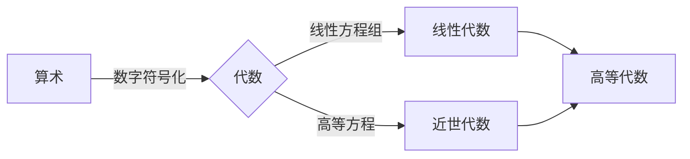

# 高等数学O级课程

[TOC]

# 一、思想准备

## 调整频率

* 与智力无关，与成熟的心智有关。

* 塑造正确的心智：正面思维

  > 吸引力法则：~~替身使者会相互吸引~~ 考虑失败就必定失败，不要怀疑
  >
  > > 例：稻盛和夫《活法》

* 明确目标，并倒推小目标

  > 经济学：未来状态的限制，以未来目标生活的状态限制当前行为

* 持续踏实的向上姿态

  > 跳出负面情绪的方法

  ```java
  安静
  ```

## 享受学习

* 专注

  ```java
  慢跑
  ```

  ```java
  看书
  ```

* 没有完美的计划 ~~敏捷开发~~

  > 方向性
  >
  > > 万事俱备 万事皆休
  >
  > 弹性
  >
  > > ~~debug~~ 试错准备
  >
  > 阶段评估

  ```java
  做一个直面现实、重视平衡的理想主义者
  ```

* 积极

  > 积分思维：复杂问题分解成无数简单问题

  > ~~“匠气”~~ 

* 练习

  ```java
  重视宏观脉络 重视动手实践
  ```

  > 例：《把时间当成朋友》

# 二、学习历史

```高等数学的技术性难度远低于初等数学(立体几何、解析几何)```

* 高等数学思想

  > 用高等数学的思想去更简单的解决问题

  > 难度在于领悟更高阶的思想

  ```目标：塑造高等思维能力```

```数学：对现实问题进行抽象，并回到现实解决现实问题```

* 代数



* 几何

  ```mermaid
  graph LR;
  几何学-->平面几何-->欧几里德几何
  平面几何-->非欧几何-->黎曼几何
  非欧几何-->微分几何
  几何学-->立体几何
  几何学--引进坐标-->解析几何--动态-->微积分<-->微分几何
  三角学--复数&欧拉公式-->三角代数化
  ```

  > 《几何原本》

* 概率论

  ```起源：数学家们生活所迫，为权贵研究如何成为赌怪```

  ```mermaid
  graph LR;
  赌博--事件化-->古典概率论--事件变量化-->概率论
  概率论-->八大分布
  八大分布-->01分布
  八大分布-->二项分布
  八大分布-->泊松分布
  八大分布-->几何分布
  八大分布-->超几何分布
  八大分布-->均匀分布
  八大分布-->指数分布
  八大分布-->正态分布
  概率论-->数理统计
  微积分-->概率论
  ```

  > 事件变量化：在事件中引入随机变量+函数

  ```mermaid
  graph TD;
  数字特征-->期望
  数字特征-->方差
  数字特征-->协方差
  数字特征-->相关系数
  ```

## 函数

### 函数的定义域及求函数表达式

```$f(x)$```

是一种映射关系，从实数集（或其子集）X到实数集Y的映射通常称为定义在X上的函数

```函：中国古代指盒子```

```函数：给一个自变量，进入“盒子”，出来一个因变量```

* #### 组成：

  * 对应规则
  * 定义域

  ```相同函数的对应关系和定义域均需相同```

  > 例（定义域）：$f(x)=\lg x^2$ 和$g(x)=2\lg x$是否相同？
  >
  > 解（定义域）：否，$x\in(-\infty,0)\bigcup(0,+\infty)和x\in(0,+\infty)$

  > 例（对应关系）：$f(x)=x$和$g(x)=\sqrt x^2$s是否相同？
  >
  > 解（对应关系）：否，$g(x)=\sqrt x^2=｜x｜= \begin{cases}-x,& x<0\\x,& x>0 \end{cases} $

* #### 常见规则：

  * 分式中分母不为零

  * 偶次方根内必须大于等于零

  * 对数的真数必须大于零

  * 反三角函数：

    $y = \arcsin(x)$与$y = \arccos(x)$的定义域必须为$-1\leq x\leq1$

  * 三角函数：

    $y=\tan(x)$的定义域$x\neq kπ + π/2$

    $y=\cot(x)$的定义域$x\neq kπ,k为整数$

    > 例1：求$y = sin\sqrt{x}$的定义域
    >
    > 解1：$D= \{ x|x\geq0 \}$

    > 例2：求$y = \tan(x+1)$的定义域
    >
    > 解2：$D=\{x|x\neq kπ+π/2-1,k=0,\pm1,\cdots \}$

    > 例3：求y = arcsin(x-3)的定义域
    >
    > 解3：$D=\{x|2\leq x\leq4\}$

    > 例4：求$y=\frac{1}{1-x^2}+\sqrt{x+1})$的定义域
    >
    > 解4：$x\in(-1,1)\bigcup(1,+\infty)$

    > 例5：已知$f(x)$的定义域为$D=\{0,1\}$，求$f(x^2)$的定义域
    >
    > 解5：$D=[-1,1]$

    > 例6：在例5的函数中，$f(x+a)$其中$a>0$，求$f(x+a)$的定义域
    >
    > 解6：$D=\{x|-a\leq x\leq 1-a,a>0\}$

    > 例7：$f(x)=\lg x^2$ 和$g(x)=2\lg x$是否为同一函数？
    >
    > 解7：相同函数的对应关系和<u>定义域</u>均需相同$x\in(-\infty,0)\bigcup(0,+\infty)\text和x\in(0,+\infty)$

### 函数的抽象态

* #### 思路：正向

  > 例：已知函数$f(x)=x^2+1$,求$f(x^2-1)$的表达式
  >
  > 解：
  >
  > $\because f(x^2-1)=(x^2-1)+1$
  >
  > ​					  $= x^4-2x^2+1+1$
  >
  > $\therefore f(x^2-1)=x^4-2x^2+2$

* #### 思路：逆向

  > 例：已知表达式$f(x+\frac{1}{x})=x^2+\frac{1}{x^2}$,求原函数$f(x)$
  >
  > 解：
  >
  > 设$t=x+\frac{1}{x}$
  >
  > $\because f(x+\frac{1}{x})=x^2+\frac{1}{x^2}$
  >
  > $\therefore f(t)=t^2-2$
  >
  > > 函数内的字母无论是t还是x，只要定义域和数值域相同，就是同一函数
  >
  > $\therefore f(x)=x^2-2$

*   #### 思路：由未知到已知

  >例：已知$f[\sin(\frac{x}{2})]=1+\cos x$，求$f(\cos x)$的表达式
  >
  >解：
  >
  >根据三角函数的特性可知$\cos x=\sin(\pi/2-x)$
  >
  >$\because f(\cos x)=f[\sin(\frac{\pi}{2}-x)]$
  >
  >$\therefore f(\cos x)=f\{sin[\frac{\pi-2x}{2}]\}$
  >
  >将$\pi-2x$替换为$x$，根据已知三角函数转换规则
  >
  >$\therefore f(\cos x)=1+\cos(\pi-2x)$
  >
  >$\therefore f(\cos x)=1-\cos2x$
  >
  >$\therefore f(\cos x)=2sin^2$
  
* #### 思路：由已知到未知

  > 例：已知$f[\sin(\frac{x}{2})]=1+\cos x$，求$f(\cos x)$的表达式
  >
  > 解：
  >
  > 降阶后并根据$\sin^2x+\cos^2=1$可得：
  >
  > $\therefore f[\sin(\frac{x}{2})]=2\cos^2(\frac{x}{2})=2[1-\sin^2(\frac{x}{2})]$
  >
  > 将$\sin \frac{x}{2}$设为$t$,可得
  >
  > $\therefore f(t)=2(1-t^2)$
  >
  > $\therefore f(x)=2(1-x^2)$
  >
  > 将x广义为$\cos x$
  >
  > $\therefore f(\cos x)=2(1-\cos^2x)=2sin^2x$

*   #### 思路：反函数

  > 例：已知$f(x)=e^{x^2},f[\varphi(x)]=1-x$，且已知$\varphi(x)\geq0$，求$\varphi(x)$的定义域
  >
  > 解：
  >
  > 将函数广义化为$\varphi(x)$后可得
  >
  > $\therefore f[\varphi(x)]=e^{[\varphi(x)]^2}$
  >
  > $\therefore 1-x=e^{[\varphi(x)]^2}$
  >
  > 根据**$\ln$和$e$互为反函数**可得：
  >
  > $\therefore\ln(1-x)=[\varphi(x)]^2$
  >
  > $\therefore \varphi(x)=\pm\sqrt{\ln(1-x)}$
  >
  > 又根据题目已知$\because \varphi(x)\geq0$
  >
  > $\therefore\varphi(x)=\sqrt{\ln(1-x)}$ 
  >
  > $\therefore \begin{cases}\ln(1-x)\geq0\\1-x>0\end{cases}$
  >
  > $\because \ln1=0$
  >
  > $\therefore \begin{cases}x\leq0\\x<1\end{cases}$
  >
  > 复合后得$\therefore x\leq0$

* #### 思路：换元

  ```函数的变量不影响函数的对应关系```
  
  > 例：已知$af(x)+bf(\frac{1}{x})=\frac{c}{x}$，且$|a|\neq|b|$，证明$f(x)$为奇函数
  >
  > 解：
  >
  > 根据奇函数可知需求证：$f(x)=-f(-x)$
  >
  > 令$t=\frac{1}{x}$得$af(\frac{1}{t})+bf(t)=ct$
  >
  > $\therefore af(\frac{1}{x})+bf(x)=cx\tag{2}$
  >
  > 令$(1)\times a$得$a^2f(x)+abf(\frac{1}{x})=\frac{ac}{x}\tag{3}$
  >
  > 令$(2)\times b$得$abf(\frac{1}{x})+b^2f(x)=bcx\tag{4}$
  >
  > $(3)-(4)$可得：$\begin{align*}a^2f(x)-b^2f(x)&=\frac{ac}{x}-bcx\\(a^2-b^2)f(x)&=\frac{ac-bcx^2}{x}\end{align*}$
  >
  >  又根据$|a|\neq|b|$可知$a^2-b^2\neq0$
  > $\therefore f(x)=\frac{ac-bcx^2}{(a^2-b^2)x}$   
  >
  >  代入$-x$可得：$f(x)=\frac{ac-bcx^2}{-(a^2-b^2)x}=-f(x)$
  >
  > $\therefore f(x)$为奇函数

### 反函数及函数复合方法

​	存在两个函数值对应同一个因变量，但不存在一个函数值对应两个因变量。```函数必须有明确的对应关系```

* #### 反函数

  $\begin{cases}y=f(x)\\x=f^{-1}(y)\end{cases}$互为反函数，且图像相同

  ```反函数的定义域=原函数的值域```

  $\begin{cases}y=f(x)\\y=f^{-1}(x)\end{cases}$图像关于$y=x$对称

  > 例1：求函数$y=\frac{2^x}{2^x+1}$的反函数及其定义域
  >
  > 解1：
  >
  > $\because y=\frac{2^x}{2^x+1}$
  >
  > $\therefore 2^xy+y=2^2$
  >
  > $\therefore y=2^x(1-y)$
  >
  > $\therefore 2^x=\frac{y}{1-y}$
  >
  > $\therefore x=\log_2(\frac{y}{1-y})$
  >
  > $\therefore$取得反函数的对应规则$y=log_2[\frac{x}{1-x}]$

  ```可以求反函数的定义域```

  > $\therefore \begin{cases}\frac{x}{1-x}>0\\1-x\neq0\end{cases}$
  >
  > $\therefore0<x<1$

  ```也可以求原函数的值域```

  > 原函数未限制定义域，既$x\in(-\infty,+\infty)$
  >
  > 将$+\infty$代入原函数可得
  >
  > $\therefore\lim_{x \to +\infty}\frac{2^x}{2^x+1}=1$
  >
  > 将$-\infty$代入原函数可得
  >
  > $\therefore \lim_{x \to -\infty}\frac{2^x}{2^x+1}=0$
  >
  > $\therefore 0<y<1$转换为反函数为$0<x<1$

* #### 分段函数

  > 例1：求$y=f(x)=\begin{cases}x,&-\infty<x<1\\x^2,&1\leq x\leq4\\2^x,&4<x<+\infty\end{cases}$的反函数
  >
  > 解1：分段求解
  >
  > （1）$y=f^{-1}(x)=x,(-\infty<x<1)$
  >
  > （2）$y=f^{-1}(x)=\sqrt{x},(1\leq x\leq16)$
  >
  > （3）$y=f^{-1}(x)=\log_2x,(16<x<+\infty)$
  >
  > $\therefore y=f^{-1}(x)=\begin{cases}x,&-\infty<x<1\\\sqrt{x},&1\leq x\leq16\\\log_2x,&16<x<+\infty\end{cases}$

  > 例2：求$y=f(x)=\begin{cases}1+x^2,&x>0\\0,&x=0\\-1-x^2,&x<0\end{cases}$的反函数
  >
  > 解2：分段求解
  >
  > （1）当$x>0$时：$y=f^{-1}(x)=\sqrt{x-1},(x>1)$
  >
  > （2）当$x=0$时：$y=0$
  >
  > （3）当$x<0$时：$y=f^{-1}(x)=-\sqrt{-1-x},(x<-1)$
  >
  > $\therefore y=f^{-1}(x)=\begin{cases}\sqrt{x-1},&x>1\\0,&x=0\\-\sqrt{1-x},&x<-1\end{cases}$

  > 例3：求$y=\frac{x+2}{x-2}$的反函数
  >
  > 解3：根据原函数可得$y=f^{-1}(x)=\frac{2+2x}{x-1}$，自然定义域为$x\neq1$

* #### 复合函数

  函数$g$与函数$f$构成的复合函数，若按“先$g$后$f$”的次序复合，通常记为$(f\circ g)(x)$即$(f\circ g)(x)=f[g(x)]$
  
  > 例1：存在函数
  > $$
  > \begin{equation}f(x)=\begin{cases}1,&|x|<1\\0,&|x|=1\\-1,&|x|>1\end{cases}\label{eq:tiaojian2}\end{equation}
  > $$
  > 和$g(x)=e^x$,求$f[g(x)]$的反函数$g[f(x)]$
  > $$
  > e=\lim_{n\to+\infty}(1+\frac{1}{n})^n,\text{e等于2.71828183...，是自然常数、无限不循环小数、超越数}
  > $$
  > 解1：将$g(x)$套入$f(x)$可得$f[g(x)]=\begin{cases}1,&e^x<1\\0,&e^x=1\\-1,&e^x>1\end{cases}$
  >
  > $\because e^x<1=e^0$ 和 $e^x>1=e^0$
  >
  > $\therefore x<0$ 和 $x>0$
  >
  > $\therefore f[g(x)]=\begin{cases}1,&x<0\\0,&x=0\\-1,&x>0\end{cases}$
  >
  > 将$f(x)$代入$g(x)=e^x$得$g(f(x))=e^{f(x)}$，结合$\eqref{eq:tiaojian1}$可知$g[f(x)]=\begin{cases}e,& |x|<1\\1,&|x|=0\\e^{-1},&|x|>1\end{cases}$
  
  > 例2：存在函数$f(x)=\begin{cases}\sqrt{x},&0\leq x<4\\x,&4\leq x<6\end{cases}$ 和 $g(x)=\begin{cases}x^2,&0\leq x<2\\2+x,&2\leq x\leq4\end{cases}$
  >
  > 解2：同时考虑$f(x)$和$g(x)$的定义域，匹配四种情况讨论
  >
  > ```太麻烦了，略```
### 奇偶性、单调性、周期性

```有界性```，在极限部分补充

* #### 奇偶性

  * 偶函数

    存在$f(x),x\in D$ 在其定义域内$f(-x)=f(x)$

    函数图像关于$y轴$对称

  * 奇函数

    存在$f(x),x\in D$ 在其定义域内$f(-x)=-f(x)$

    函数图像关于$原点$对称，既$f(0)=0$

    > 例（判断有限函数的奇偶性）：$\forall y=3x^2-x^3$，判断其奇偶性
    >
    > 解（判断有限函数的奇偶行）：
    >
    > $y=3x^2$为偶函数，$y=x^3$为奇函数
    >
    > $\because 3x^2+x^3\neq\pm f(x)$
    >
    > $\therefore y=3x^2-x^3$ 为非奇非偶函数

    根据类似例题可得：

    ```奇函数+奇函数=奇函数```，```奇函数×奇函数=偶函数```

    ```偶函数+偶函数=偶函数```，```偶函数×偶函数=偶函数```

    ```奇函数+偶函数=非奇非偶函数```，```奇函数×偶函数=奇函数```

  * 非奇非偶函数

    ```所有函数均能拆分成奇函数+偶函数```

    $f(x)=\frac{1}{2}[\frac{f(x)+f(-x)}{偶函数}+\frac{f(x)-f(-x)}{奇函数}]$

    > 例（判断复合函数的奇偶性）：在区间$(-\infty,+\infty)$上，$\forall f(x)$，$g(x)$，判断$f[g(x)]$和$g[f(x)]$的奇偶性
    >
    > 解（判断复合函数的奇偶性）：
    >
    > $f(x),g(x)$奇偶性不同时，代入可得$f[g(x)],g[f(x)]$为偶函数
    >
    > $f(x),g(x)$同为奇函数时，代入可得$f[g(x)],g[f(x)]$为奇函数
    >
    > $f(x),g(x)$同为偶函数时，代入可得$f[g(x)],g[f(x)]$为偶函数

    > 例1：判断函数$f(x)=\frac{a^x-1}{a^x+1}，a\neq1\and a>0$ 的奇偶性
    > 解1：
    >
    > $\because f(-x)=\frac{a^{-x}-1}{a^{-x}+1}\\$
    >
    > 上下同乘$a^x$可得：$f(-x)=\frac{1-a^x}{1+a^x}=\frac{-(a^x-1)}{a^x+1}$
    >
    > $\therefore f(-x)=-f(x)$，函数为奇函数
    
    >例2：判断函数$f(x)=\lg\frac{1-x}{1+x}$的奇偶性
    >
    >解2：
    >
    >$\because f(x)=\lg\frac{1-x}{1+x}=\lg{(1-x)}-\lg{(1+x)}$
    >
    >$\because f(-x)=\lg{\frac{1+x}{1-x}}=lg{(1+x)}-lg{(1-x)}=-[\lg{(1-x)}-\lg(1+x)]$
    >
    >$\therefore f(-x)=-f(x)$，函数为奇函数
    
    $$
    对数运算规则：\\[2ex]
    a^{log_a{b}}=b\\[2ex]
    \log_a{a^b}=b\\[2ex]
    \log_a{m^n}=n\log_a{m}\\[2ex]
    \log_a^n{m}=\frac{1}{n\log_a{m}}\\[2ex]
    \log_a{(mn)}=\log_a{m}+\log_a{n}\\[2ex]
    \log_a{(m\div n)}=\log_a{m}-\log_a{n}\\[2ex]
    $$
    
    > 例3：$\exists f(x)=|x\sin{x}|e^{\cos{x}},\and-\infty\leq x\leq\infty$
    >
    > ​          A. 有界 		   			B.单调
    >
    > ​		  C.周期						 D.偶函数
    >
    > 解3：
    >
    > D，偶函数$\times$偶函数=偶函数

* #### 单调性

   存在函数$f(x)$在区间[a,b]内有定义，$\forall x_1,x_2\in[a,b]$，当$x_1<x_2$时

  若$f(x_1)<f(x_2)$，称为“单增”

  若$f(x_1)<f(x_2)$，称为“单减”

  ##### 其他特殊单调性：

  “凹增” 

  “凹减”

  

  <svg xmlns="http://www.w3.org/2000/svg" xmlns:xlink="http://www.w3.org/1999/xlink" width="480" height="223pt" viewBox="0 0 360 223">     <defs>         <symbol overflow="visible" id="a">             <path d="M5.29-2.191H.55v-.82h4.74zm0 0"/>         </symbol>         <symbol overflow="visible" id="b">             <path d="M3.234 0v-1.715H.125v-.805l3.27-4.636h.714v4.636h.97v.805h-.97V0zm0-2.52v-3.226L.992-2.52zm0 0"/>         </symbol>         <symbol overflow="visible" id="c">             <path d="M5.035-.844V0H.305a1.54 1.54 0 01.101-.61c.121-.324.313-.64.578-.953.266-.312.649-.671 1.149-1.085.777-.637 1.304-1.141 1.578-1.516.273-.371.41-.723.41-1.055 0-.347-.125-.644-.375-.883-.246-.238-.574-.359-.973-.359-.421 0-.761.129-1.015.383-.254.254-.383.605-.387 1.055L.47-5.117c.062-.672.293-1.188.699-1.54.402-.355.945-.53 1.625-.53.687 0 1.23.19 1.629.57.402.383.601.855.601 1.418 0 .285-.058.566-.175.844-.118.277-.313.566-.582.875-.274.304-.723.726-1.356 1.257-.527.442-.867.743-1.015.903a2.868 2.868 0 00-.372.476zm0 0"/>         </symbol>         <symbol overflow="visible" id="d">             <path d="M3.727 0h-.88v-5.602c-.21.204-.488.407-.831.606a5.902 5.902 0 01-.926.457v-.852c.492-.23.922-.511 1.289-.84.367-.328.629-.648.781-.957h.567zm0 0"/>         </symbol>         <symbol overflow="visible" id="e">             <path d="M.906 0v-1H1.91v1zm0 0"/>         </symbol>         <symbol overflow="visible" id="f">             <path d="M.414-3.531c0-.844.09-1.528.262-2.043.176-.516.433-.914.777-1.192.344-.28.774-.421 1.297-.421.383 0 .719.078 1.008.23.289.156.531.379.719.672.187.289.335.644.445 1.062.11.418.16.985.16 1.692 0 .84-.086 1.52-.258 2.035-.172.516-.43.914-.773 1.195-.344.281-.778.422-1.301.422-.691 0-1.234-.246-1.625-.742-.473-.594-.71-1.567-.71-2.91zm.906 0c0 1.176.137 1.957.41 2.347.278.387.614.582 1.02.582.402 0 .742-.195 1.016-.586.277-.39.414-1.171.414-2.343 0-1.18-.137-1.961-.414-2.348-.274-.387-.618-.582-1.028-.582-.402 0-.726.172-.965.516-.304.433-.453 1.238-.453 2.414zm0 0"/>         </symbol>         <symbol overflow="visible" id="g">             <path d="M.414-1.875l.922-.078c.07.45.23.785.476 1.012.25.226.551.34.903.34.422 0 .781-.16 1.074-.477.293-.32.438-.742.438-1.27 0-.504-.141-.898-.422-1.187-.282-.29-.649-.434-1.106-.434a1.526 1.526 0 00-1.3.692L.57-3.383l.696-3.68h3.558v.844H1.97l-.387 1.922c.43-.3.879-.45 1.352-.45a2.14 2.14 0 011.582.65c.43.433.644.992.644 1.671 0 .649-.187 1.207-.566 1.68-.457.578-1.086.867-1.88.867-.651 0-1.183-.18-1.593-.547-.41-.363-.648-.847-.707-1.449zm0 0"/>         </symbol>     </defs>     <path d="M7.66 35.668l5.371 8.715 5.367 9.754L23.77 64.78l5.37 11.371 5.372 11.914 5.367 12.274L50.62 125.2l5.371 12.198 5.367 11.786 5.371 11.195 5.372 10.426 5.367 9.492 5.37 8.414 5.372 7.203 5.371 5.883 5.367 4.465 5.371 2.98 5.371 1.453 5.368-.105 5.37-1.656 5.372-3.18 5.37-4.66 5.368-6.063 5.371-7.37 5.371-8.567 5.367-9.625 5.372-10.535 5.37-11.286 5.372-11.851 10.738-24.668 5.371-12.434 5.367-12.234 5.371-11.856 5.371-11.28 5.372-10.536 5.367-9.629 5.37-8.566 5.372-7.371 5.367-6.063 5.371-4.656 5.371-3.184 5.371-1.652 5.368-.105 5.37 1.449 5.372 2.984 5.367 4.465 5.371 5.879 5.371 7.203 5.371 8.418 5.367 9.492 5.372 10.426 5.37 11.191 10.739 23.985 5.371 12.418 5.371 12.441 5.367 12.277 5.371 11.914 5.371 11.368 5.372 10.644 5.367 9.758 5.37 8.715" fill="none" stroke-width="1.6" stroke-linecap="square" stroke="#5e81b5" stroke-miterlimit="3.25"/>     <path d="M7.66 111.129v-4" fill="none" stroke-width=".2" stroke="#666" stroke-miterlimit="3.25"/>     <use xlink:href="#a" x="1.66" y="123.128" fill="#666"/>     <use xlink:href="#b" x="7.66" y="123.128" fill="#666"/>     <path d="M29.14 111.129v-2.402M50.621 111.129v-2.402M72.102 111.129v-2.402M93.578 111.129v-4" fill="none" stroke-width=".2" stroke="#666" stroke-miterlimit="3.25"/>     <use xlink:href="#a" x="87.58" y="123.128" fill="#666"/>     <use xlink:href="#c" x="93.58" y="123.128" fill="#666"/>     <path d="M115.059 111.129v-2.402M136.54 111.129v-2.402M158.02 111.129v-2.402M179.5 111.129v-4M200.98 111.129v-2.402M222.46 111.129v-2.402M243.941 111.129v-2.402M265.422 111.129v-4" fill="none" stroke-width=".2" stroke="#666" stroke-miterlimit="3.25"/>     <use xlink:href="#c" x="262.42" y="123.128" fill="#666"/>     <path d="M286.898 111.129v-2.402M308.379 111.129v-2.402M329.86 111.129v-2.402M351.34 111.129v-4" fill="none" stroke-width=".2" stroke="#666" stroke-miterlimit="3.25"/>     <use xlink:href="#b" x="348.34" y="123.128" fill="#666"/>     <path d="M.5 111.129h358M179.5 220.813h2.398M179.5 210.84h4" fill="none" stroke-width=".2" stroke="#666" stroke-miterlimit="3.25"/>     <use xlink:href="#a" x="156.5" y="213.34" fill="#666"/>     <g fill="#666">         <use xlink:href="#d" x="162.5" y="213.34"/>         <use xlink:href="#e" x="168.062" y="213.34"/>         <use xlink:href="#f" x="170.84" y="213.34"/>     </g>     <path d="M179.5 200.867h2.398M179.5 190.898h2.398M179.5 180.926h2.398M179.5 170.957h2.398M179.5 160.984h4" fill="none" stroke-width=".2" stroke="#666" stroke-miterlimit="3.25"/>     <use xlink:href="#a" x="156.5" y="163.484" fill="#666"/>     <g fill="#666">         <use xlink:href="#f" x="162.5" y="163.484"/>         <use xlink:href="#e" x="168.062" y="163.484"/>         <use xlink:href="#g" x="170.84" y="163.484"/>     </g>     <path d="M179.5 151.012h2.398M179.5 141.043h2.398M179.5 131.07h2.398M179.5 121.098h2.398M179.5 111.129h4M179.5 101.156h2.398M179.5 91.188h2.398M179.5 81.215h2.398M179.5 71.242h2.398M179.5 61.273h4" fill="none" stroke-width=".2" stroke="#666" stroke-miterlimit="3.25"/>     <g fill="#666">         <use xlink:href="#f" x="162.5" y="63.772"/>         <use xlink:href="#e" x="168.062" y="63.772"/>         <use xlink:href="#g" x="170.84" y="63.772"/>     </g>     <path d="M179.5 51.3h2.398M179.5 41.328h2.398M179.5 31.36h2.398M179.5 21.387h2.398M179.5 11.418h4" fill="none" stroke-width=".2" stroke="#666" stroke-miterlimit="3.25"/>     <g fill="#666">         <use xlink:href="#d" x="162.5" y="13.916"/>         <use xlink:href="#e" x="168.062" y="13.916"/>         <use xlink:href="#f" x="170.84" y="13.916"/>     </g>     <path d="M179.5 1.445h2.398M179.5 221.758V.5" fill="none" stroke-width=".2" stroke="#666" stroke-miterlimit="3.25"/> </svg>
  
  > 例1：$\exist f(x)和\varphi(x)$均为单减函数，求$f(\varphi(x))$的单调性
  >
  > 解1：
  >
  > 根据$f(x)$和$\varphi(x)$的单调性可知：
  >
  > 假设存在$x_1<x_2$，则有$\varphi(x_1)$>$\varphi(x_2)$
  >
  > $\therefore f[\varphi(x_1)]<f[\varphi(x_2)]$
  >
  > 可知复合函数$f[\varphi(x)]$为单调增函数
  
  #### 附：在 Markdown 中绘制函数图像  ####

​			使用 `SVG` 首先用 Mathematica 绘图并导出SVG

 			```Plot[Sin[x], {x, -4, 4}, PlotPoints -> 2] Export["sin.svg", %] ``` 

​			接下来使用 [svgo](https://github.com/svg/svgo) 做一下压缩

 			```sh svgo --pretty sin.svg ```

* #### 周期性

  设函数$f(x)$的定义域为$D$，如果存在一个正数$l$，使得对于任一$x\in D$有$(x\pm l)\in D$，且$f(x+l)=f(x)$恒成立，则称$f(x)$为周期函数，$l$称为$f(x)$的周期，通常我们说周期函数的周期是指最小正周期。

  如：三角函数，周期为2$\pi $、$ \pi$，$f(x+T)=f(x)$周期为T

  
  
  > 例1：已知$f(x)$的周期为T，求$f(ax+b)$的周期
>
  > 解1：$\frac{T}{|a|}$

  ```注1：周期均为正数```
  
  > 例2：已知$f(x)$和$g(x)$的周期为T，求$f(x)\pm g(x)$的周期
>
  > 解2：T

  ```注2:相同周期函数加减后，周期仍为原周期```
  
  > 例3：已知$f(x)$和$g(x)$的周期分别为$T_1$$T_2$，求两函数运算后的周期
>
  > 解3：$T_1T_2$的最小公倍数

  ```注3:不同周期函数运算后，周期为两函数周期的最小公倍数```
  
  > 例4：求$f(x)=|sinx|$的周期
>
  > 解4：根据诱导公式$f(x)=|sin(x+\pi)|=｜-sinx｜=|sinx|$，所以函数周期为$ \pi$
  
  > 例5：以下哪个函数有周期性
  >
  > ​		  A.$x\sin2x$	B.$cosx^2$	C.$x-\sin^2x$	D.$\cos^2x$
>
  > 解5：D，$\cos^2x=\frac{1+cos2x}{2}$

  ```注4：常数具有周期性```

  ```注5：周期性函数和非周期性函数运算后为非周期性函数```
  
  ```
  注重数形结合
  ```

### 指数函数、对数函数、幂函数

* #### 指数函数

  $y=a^x(a>0且a\neq1)$，a为固定实数

  ```x为0时，无论a为多少，y等于1```

  ```a为0时函数无意义```

  运算法则：

  * $a^x\cdot a^y=a^{x+y}$
  * $(a^x)^y=a^{xy}$
  * $(ab)^x=a^xb^x$
  * $(\frac{a}{b})^x=\frac{a^x}{b^x}$
  * $a^{-x}=\frac{1}{a^x}$
  * $a^{\frac{m}{n}}=\sqrt[n]{a^m}$

  $$
  e,欧拉数\\[2ex]e\approx2.718281
  $$

  $$\begin{array}{c|lcr}
  \text{原函数} & \text{反函数} \\
  \hline
  y=a^x & y=\log_a{x}  \\
  y=e^x & y=\ln{x} \\
  \end{array}$$

  ​	```指数函数恒为正```

  ​	```指数为0的函数值均为1```

  <!DOCTYPE svg PUBLIC "-//W3C//DTD SVG 1.1//EN" "http://www.w3.org/Graphics/SVG/1.1/DTD/svg11.dtd"><svg xmlns="http://www.w3.org/2000/svg" viewBox="0 0 650 400" version="1.1"><clipPath id="box"><rect x="0" y="0" width="650" height="400" style="fill:none;stroke:none;" /></clipPath><g clip-path="url(#box)"><rect x="0.00" y="0.00" width="650.00" height="400.00" style="fill:#FFFFFF;stroke:none;" /><path d="M0.00 400.00 L650.00 400.00 M0.00 350.00 L650.00 350.00 M0.00 300.00 L650.00 300.00 M0.00 250.00 L650.00 250.00 M0.00 200.00 L650.00 200.00 M0.00 150.00 L650.00 150.00 M0.00 100.00 L650.00 100.00 M0.00 50.00 L650.00 50.00 M0.00 0.00 L650.00 0.00 M25.00 0.00 L25.00 400.00 M75.00 0.00 L75.00 400.00 M125.00 0.00 L125.00 400.00 M175.00 0.00 L175.00 400.00 M225.00 0.00 L225.00 400.00 M275.00 0.00 L275.00 400.00 M325.00 0.00 L325.00 400.00 M374.00 0.00 L374.00 400.00 M425.00 0.00 L425.00 400.00 M475.00 0.00 L475.00 400.00 M525.00 0.00 L525.00 400.00 M575.00 0.00 L575.00 400.00 M625.00 0.00 L625.00 400.00 " style="fill:none;stroke:#D0D0D0;stroke-width:1;" /><path d="M325.00 0.00 L325.00 400.00 " style="fill:none;stroke:#000000;stroke-width:1;" /><path d="M318.50 400.00 L331.50 400.00 M318.50 350.00 L331.50 350.00 M318.50 300.00 L331.50 300.00 M318.50 250.00 L331.50 250.00 M318.50 200.00 L331.50 200.00 M318.50 150.00 L331.50 150.00 M318.50 100.00 L331.50 100.00 M318.50 50.00 L331.50 50.00 M318.50 0.00 L331.50 0.00 " style="fill:none;stroke:#000000;stroke-width:1;" /><path d="M0.00 200.00 L650.00 200.00 " style="fill:none;stroke:#000000;stroke-width:1;" /><path d="M-25.00 193.50 L-25.00 206.50 M25.00 193.50 L25.00 206.50 M75.00 193.50 L75.00 206.50 M125.00 193.50 L125.00 206.50 M175.00 193.50 L175.00 206.50 M225.00 193.50 L225.00 206.50 M275.00 193.50 L275.00 206.50 M325.00 193.50 L325.00 206.50 M375.00 193.50 L375.00 206.50 M425.00 193.50 L425.00 206.50 M475.00 193.50 L475.00 206.50 M525.00 193.50 L525.00 206.50 M575.00 193.50 L575.00 206.50 M625.00 193.50 L625.00 206.50 " style="fill:none;stroke:#000000;stroke-width:1;" /><text x="333.125" y="352.5" text-anchor="start" style="font:10px Droid Sans,Trebuchet MS,Arial,Helvetica,sans-serif;stroke:none;fill:#000000">-3</text><text x="333.125" y="302.5" text-anchor="start" style="font:10px Droid Sans,Trebuchet MS,Arial,Helvetica,sans-serif;stroke:none;fill:#000000">-2</text><text x="333.125" y="252.5" text-anchor="start" style="font:10px Droid Sans,Trebuchet MS,Arial,Helvetica,sans-serif;stroke:none;fill:#000000">-1</text><text x="333.125" y="202.5" text-anchor="start" style="font:10px Droid Sans,Trebuchet MS,Arial,Helvetica,sans-serif;stroke:none;fill:#000000">0</text><text x="333.125" y="152.5" text-anchor="start" style="font:10px Droid Sans,Trebuchet MS,Arial,Helvetica,sans-serif;stroke:none;fill:#000000">1</text><text x="333.125" y="102.5" text-anchor="start" style="font:10px Droid Sans,Trebuchet MS,Arial,Helvetica,sans-serif;stroke:none;fill:#000000">2</text><text x="333.125" y="52.5" text-anchor="start" style="font:10px Droid Sans,Trebuchet MS,Arial,Helvetica,sans-serif;stroke:none;fill:#000000">3</text><text x="25" y="216.125" text-anchor="middle" style="font:10px Droid Sans,Trebuchet MS,Arial,Helvetica,sans-serif;stroke:none;fill:#000000">-6</text><text x="75" y="216.125" text-anchor="middle" style="font:10px Droid Sans,Trebuchet MS,Arial,Helvetica,sans-serif;stroke:none;fill:#000000">-5</text><text x="125" y="216.125" text-anchor="middle" style="font:10px Droid Sans,Trebuchet MS,Arial,Helvetica,sans-serif;stroke:none;fill:#000000">-4</text><text x="175" y="216.125" text-anchor="middle" style="font:10px Droid Sans,Trebuchet MS,Arial,Helvetica,sans-serif;stroke:none;fill:#000000">-3</text><text x="225" y="216.125" text-anchor="middle" style="font:10px Droid Sans,Trebuchet MS,Arial,Helvetica,sans-serif;stroke:none;fill:#000000">-2</text><text x="275" y="216.125" text-anchor="middle" style="font:10px Droid Sans,Trebuchet MS,Arial,Helvetica,sans-serif;stroke:none;fill:#000000">-1</text><text x="325" y="216.125" text-anchor="middle" style="font:10px Droid Sans,Trebuchet MS,Arial,Helvetica,sans-serif;stroke:none;fill:#000000">0</text><text x="374.99999999999994" y="216.125" text-anchor="middle" style="font:10px Droid Sans,Trebuchet MS,Arial,Helvetica,sans-serif;stroke:none;fill:#000000">1</text><text x="425" y="216.125" text-anchor="middle" style="font:10px Droid Sans,Trebuchet MS,Arial,Helvetica,sans-serif;stroke:none;fill:#000000">2</text><text x="475" y="216.125" text-anchor="middle" style="font:10px Droid Sans,Trebuchet MS,Arial,Helvetica,sans-serif;stroke:none;fill:#000000">3</text><text x="525" y="216.125" text-anchor="middle" style="font:10px Droid Sans,Trebuchet MS,Arial,Helvetica,sans-serif;stroke:none;fill:#000000">4</text><text x="575" y="216.125" text-anchor="middle" style="font:10px Droid Sans,Trebuchet MS,Arial,Helvetica,sans-serif;stroke:none;fill:#000000">5</text><text x="625" y="216.125" text-anchor="middle" style="font:10px Droid Sans,Trebuchet MS,Arial,Helvetica,sans-serif;stroke:none;fill:#000000">6</text><path d="M-10.00 200.00 L-0.25 199.93 L0.75 199.92 L2.75 199.92 L4.75 199.92 L6.75 199.91 L8.75 199.91 L10.75 199.91 L12.75 199.90 L14.75 199.90 L16.75 199.89 L18.75 199.89 L20.75 199.89 L22.75 199.88 L24.75 199.88 L26.75 199.87 L28.75 199.87 L30.75 199.86 L32.75 199.86 L34.75 199.85 L36.75 199.84 L38.75 199.84 L40.75 199.83 L42.75 199.82 L44.75 199.82 L46.75 199.81 L48.75 199.80 L50.75 199.79 L52.75 199.78 L54.75 199.78 L56.75 199.77 L58.75 199.76 L60.75 199.75 L62.75 199.74 L64.75 199.73 L66.75 199.71 L68.75 199.70 L70.75 199.69 L72.75 199.68 L74.75 199.66 L76.75 199.65 L78.75 199.64 L80.75 199.62 L82.75 199.61 L84.75 199.59 L86.75 199.57 L88.75 199.56 L90.75 199.54 L92.75 199.52 L94.75 199.50 L96.75 199.48 L98.75 199.46 L100.75 199.44 L102.75 199.41 L104.75 199.39 L106.75 199.36 L108.75 199.34 L110.75 199.31 L112.75 199.28 L114.75 199.25 L116.75 199.22 L118.75 199.19 L120.75 199.16 L122.75 199.12 L124.75 199.09 L126.75 199.05 L128.75 199.01 L130.75 198.97 L132.75 198.93 L134.75 198.89 L136.75 198.84 L138.75 198.79 L140.75 198.75 L142.75 198.69 L144.75 198.64 L146.75 198.59 L148.75 198.53 L150.75 198.47 L152.75 198.40 L154.75 198.34 L156.75 198.27 L158.75 198.20 L160.75 198.13 L162.75 198.05 L164.75 197.97 L166.75 197.89 L168.75 197.80 L170.75 197.71 L172.75 197.62 L174.75 197.52 L176.75 197.42 L178.75 197.32 L180.75 197.21 L182.75 197.09 L184.75 196.97 L186.75 196.85 L188.75 196.72 L190.75 196.59 L192.75 196.45 L194.75 196.30 L196.75 196.15 L198.75 196.00 L200.75 195.83 L202.75 195.66 L204.75 195.49 L206.75 195.30 L208.75 195.11 L210.75 194.91 L212.75 194.70 L214.75 194.49 L216.75 194.26 L218.75 194.03 L220.75 193.78 L222.75 193.53 L224.75 193.27 L226.75 192.99 L228.75 192.71 L230.75 192.41 L232.75 192.10 L234.75 191.78 L236.75 191.44 L238.75 191.09 L240.75 190.73 L242.75 190.35 L244.75 189.96 L246.75 189.55 L248.75 189.12 L250.75 188.67 L252.75 188.21 L254.75 187.73 L256.75 187.23 L258.75 186.71 L260.75 186.17 L262.75 185.60 L264.75 185.02 L266.75 184.40 L268.75 183.77 L270.75 183.10 L272.75 182.42 L274.75 181.70 L276.75 180.95 L278.75 180.17 L280.75 179.36 L282.75 178.52 L284.75 177.65 L286.75 176.73 L288.75 175.78 L290.75 174.80 L292.75 173.77 L294.69 172.73 L296.56 171.69 L298.36 170.65 L300.10 169.61 L301.77 168.58 L303.39 167.55 L304.96 166.51 L306.47 165.48 L307.94 164.45 L309.37 163.42 L310.76 162.39 L312.10 161.37 L313.42 160.34 L314.69 159.31 L315.94 158.29 L317.15 157.26 L318.34 156.24 L319.49 155.22 L320.62 154.19 L321.73 153.17 L322.81 152.15 L323.86 151.13 L324.90 150.10 L325.91 149.08 L326.90 148.06 L327.87 147.04 L328.83 146.02 L329.76 145.01 L330.68 143.99 L331.58 142.97 L332.46 141.95 L333.33 140.93 L334.19 139.92 L335.03 138.90 L335.85 137.88 L336.66 136.86 L337.46 135.85 L338.25 134.83 L339.02 133.82 L339.78 132.80 L340.53 131.79 L341.27 130.77 L342.00 129.76 L342.71 128.74 L343.42 127.73 L344.12 126.71 L344.80 125.70 L345.48 124.69 L346.15 123.67 L346.81 122.66 L347.46 121.65 L348.10 120.63 L348.74 119.62 L349.36 118.61 L349.98 117.59 L350.59 116.58 L351.20 115.57 L351.79 114.56 L352.38 113.55 L352.96 112.53 L353.54 111.52 L354.10 110.51 L354.67 109.50 L355.22 108.49 L355.77 107.48 L356.31 106.47 L356.85 105.46 L357.38 104.44 L357.91 103.43 L358.43 102.42 L358.95 101.41 L359.46 100.40 L359.96 99.39 L360.46 98.38 L360.95 97.37 L361.44 96.36 L361.93 95.35 L362.41 94.34 L362.88 93.33 L363.36 92.32 L363.82 91.31 L364.28 90.31 L364.74 89.30 L365.20 88.29 L365.65 87.28 L366.09 86.27 L366.53 85.26 L366.97 84.25 L367.40 83.24 L367.83 82.23 L368.26 81.23 L368.68 80.22 L369.10 79.21 L369.52 78.20 L369.93 77.19 L370.34 76.18 L370.74 75.18 L371.15 74.17 L371.55 73.16 L371.94 72.15 L372.33 71.14 L372.72 70.14 L373.11 69.13 L373.49 68.12 L373.87 67.11 L374.25 66.10 L374.63 65.10 L375.00 64.09 L375.37 63.08 L375.73 62.07 L376.10 61.07 L376.46 60.06 L376.82 59.05 L377.17 58.05 L377.53 57.04 L377.88 56.03 L378.23 55.02 L378.57 54.02 L378.92 53.01 L379.26 52.00 L379.60 51.00 L379.93 49.99 L380.27 48.98 L380.60 47.98 L380.93 46.97 L381.26 45.96 L381.58 44.96 L381.91 43.95 L382.23 42.94 L382.55 41.94 L382.87 40.93 L383.18 39.92 L383.49 38.92 L383.81 37.91 L384.12 36.91 L384.42 35.90 L384.73 34.89 L385.03 33.89 L385.33 32.88 L385.63 31.88 L385.93 30.87 L386.23 29.86 L386.52 28.86 L386.82 27.85 L387.11 26.85 L387.40 25.84 L387.69 24.83 L387.97 23.83 L388.26 22.82 L388.54 21.82 L388.82 20.81 L389.10 19.81 L389.38 18.80 L389.66 17.79 L389.93 16.79 L390.20 15.78 L390.48 14.78 L390.75 13.77 L391.02 12.77 L391.28 11.76 L391.55 10.76 L391.82 9.75 L392.08 8.75 L392.34 7.74 L392.60 6.74 L392.86 5.73 L393.12 4.72 L393.38 3.72 L393.63 2.71 L393.89 1.71 L394.14 0.70 L394.39 -0.30 " style="fill:none;stroke:#000000;stroke-width:1;" /><path d="M325.92 400.04 L325.92 399.99 L325.93 399.00 L325.95 398.02 L325.97 397.04 L325.99 396.06 L326.01 395.08 L326.03 394.10 L326.05 393.12 L326.07 392.13 L326.09 391.15 L326.11 390.17 L326.14 389.19 L326.16 388.21 L326.18 387.23 L326.21 386.25 L326.23 385.27 L326.25 384.29 L326.28 383.31 L326.30 382.33 L326.33 381.35 L326.36 380.37 L326.38 379.39 L326.41 378.41 L326.44 377.43 L326.47 376.45 L326.50 375.46 L326.53 374.48 L326.56 373.50 L326.59 372.52 L326.62 371.54 L326.65 370.56 L326.68 369.58 L326.72 368.60 L326.75 367.62 L326.78 366.64 L326.82 365.66 L326.86 364.68 L326.89 363.70 L326.93 362.72 L326.97 361.74 L327.01 360.76 L327.05 359.78 L327.09 358.79 L327.13 357.81 L327.17 356.83 L327.21 355.85 L327.26 354.87 L327.30 353.89 L327.35 352.91 L327.40 351.93 L327.44 350.95 L327.49 349.97 L327.54 348.99 L327.59 348.01 L327.64 347.03 L327.69 346.05 L327.75 345.07 L327.80 344.09 L327.86 343.11 L327.91 342.12 L327.97 341.14 L328.03 340.16 L328.09 339.18 L328.15 338.20 L328.21 337.22 L328.28 336.24 L328.34 335.26 L328.41 334.28 L328.48 333.30 L328.55 332.32 L328.62 331.34 L328.69 330.36 L328.76 329.38 L328.83 328.40 L328.91 327.42 L328.99 326.44 L329.07 325.46 L329.15 324.47 L329.23 323.49 L329.31 322.51 L329.40 321.53 L329.49 320.55 L329.57 319.57 L329.67 318.59 L329.76 317.61 L329.85 316.63 L329.95 315.65 L330.05 314.67 L330.15 313.69 L330.25 312.71 L330.35 311.73 L330.46 310.75 L330.57 309.77 L330.68 308.79 L330.79 307.80 L330.90 306.82 L331.02 305.84 L331.14 304.86 L331.26 303.88 L331.39 302.90 L331.51 301.92 L331.64 300.94 L331.77 299.96 L331.91 298.98 L332.04 298.00 L332.18 297.02 L332.32 296.04 L332.47 295.06 L332.62 294.08 L332.77 293.10 L332.92 292.12 L333.08 291.13 L333.24 290.15 L333.40 289.17 L333.57 288.19 L333.74 287.21 L333.91 286.23 L334.09 285.25 L334.27 284.27 L334.45 283.29 L334.64 282.31 L334.83 281.33 L335.02 280.35 L335.22 279.37 L335.43 278.39 L335.63 277.41 L335.84 276.43 L336.06 275.45 L336.28 274.46 L336.50 273.48 L336.73 272.50 L336.96 271.52 L337.20 270.54 L337.44 269.56 L337.68 268.58 L337.94 267.60 L338.19 266.62 L338.45 265.64 L338.72 264.66 L338.99 263.68 L339.27 262.70 L339.55 261.72 L339.84 260.74 L340.13 259.76 L340.43 258.78 L340.74 257.80 L341.05 256.81 L341.37 255.83 L341.69 254.85 L342.02 253.87 L342.36 252.89 L342.70 251.91 L343.05 250.93 L343.41 249.95 L343.78 248.97 L344.15 247.99 L344.53 247.01 L344.91 246.03 L345.31 245.05 L345.71 244.07 L346.12 243.09 L346.54 242.11 L346.97 241.13 L347.40 240.14 L347.85 239.16 L348.30 238.18 L348.76 237.20 L349.23 236.22 L349.71 235.24 L350.20 234.26 L350.70 233.28 L351.21 232.30 L351.73 231.32 L352.26 230.34 L352.80 229.36 L353.35 228.38 L353.91 227.40 L354.48 226.42 L355.06 225.44 L355.66 224.46 L356.27 223.47 L356.89 222.49 L357.52 221.51 L358.16 220.53 L358.82 219.55 L359.49 218.57 L360.17 217.59 L360.87 216.61 L361.58 215.63 L362.30 214.65 L363.04 213.67 L363.79 212.69 L364.56 211.71 L365.35 210.73 L366.14 209.75 L366.96 208.77 L367.79 207.79 L368.64 206.81 L369.50 205.82 L370.38 204.84 L371.28 203.86 L372.20 202.88 L373.13 201.90 L374.09 200.92 L375.06 199.94 L376.05 198.96 L377.06 197.98 L378.09 197.00 L379.14 196.02 L380.22 195.04 L381.31 194.06 L382.43 193.08 L383.56 192.10 L384.72 191.12 L385.91 190.14 L387.11 189.15 L388.34 188.17 L389.60 187.19 L390.88 186.21 L392.18 185.23 L393.51 184.25 L394.87 183.27 L396.25 182.29 L397.66 181.31 L399.10 180.33 L400.57 179.35 L402.07 178.37 L403.59 177.39 L405.15 176.41 L406.74 175.43 L408.35 174.45 L410.01 173.47 L411.69 172.48 L413.41 171.50 L415.16 170.52 L416.94 169.54 L418.76 168.56 L420.62 167.58 L422.51 166.60 L424.45 165.62 L426.42 164.64 L428.42 163.66 L430.42 162.71 L432.42 161.77 L434.42 160.84 L436.42 159.94 L438.42 159.05 L440.42 158.17 L442.42 157.32 L444.42 156.47 L446.42 155.64 L448.42 154.82 L450.42 154.02 L452.42 153.23 L454.42 152.45 L456.42 151.68 L458.42 150.93 L460.42 150.18 L462.42 149.45 L464.42 148.73 L466.42 148.02 L468.42 147.31 L470.42 146.62 L472.42 145.94 L474.42 145.26 L476.42 144.60 L478.42 143.94 L480.42 143.30 L482.42 142.66 L484.42 142.03 L486.42 141.40 L488.42 140.79 L490.42 140.18 L492.42 139.58 L494.42 138.98 L496.42 138.40 L498.42 137.82 L500.42 137.24 L502.42 136.68 L504.42 136.12 L506.42 135.56 L508.42 135.01 L510.42 134.47 L512.42 133.93 L514.42 133.40 L516.42 132.88 L518.42 132.36 L520.42 131.84 L522.42 131.34 L524.42 130.83 L526.42 130.33 L528.42 129.84 L530.42 129.35 L532.42 128.87 L534.42 128.39 L536.42 127.91 L538.42 127.44 L540.42 126.97 L542.42 126.51 L544.42 126.05 L546.42 125.60 L548.42 125.15 L550.42 124.70 L552.42 124.26 L554.42 123.82 L556.42 123.39 L558.42 122.96 L560.42 122.53 L562.42 122.11 L564.42 121.69 L566.42 121.28 L568.42 120.86 L570.42 120.45 L572.42 120.05 L574.42 119.65 L576.42 119.25 L578.42 118.85 L580.42 118.46 L582.42 118.07 L584.42 117.68 L586.42 117.30 L588.42 116.91 L590.42 116.54 L592.42 116.16 L594.42 115.79 L596.42 115.42 L598.42 115.05 L600.42 114.69 L602.42 114.33 L604.42 113.97 L606.42 113.61 L608.42 113.26 L610.42 112.90 L612.42 112.55 L614.42 112.21 L616.42 111.86 L618.42 111.52 L620.42 111.18 L622.42 110.84 L624.42 110.51 L626.42 110.18 L628.42 109.85 L630.42 109.52 L632.42 109.19 L634.42 108.87 L636.42 108.54 L638.42 108.22 L640.42 107.91 L642.42 107.59 L644.42 107.28 L646.42 106.96 L648.42 106.65 " style="fill:none;stroke:#000000;stroke-width:1;" /></g></svg>

  * $\ln{e}=1$ 
  * $\ln1=0$
  * $\log_acd=\log_ac+\log_ad$
  * $\ln{AB}=\ln{A}+\ln{B}$
  * $\log_a\frac{c}{d}=\log_ac-\log_ad$
  * $\ln\frac{A}{B}=\ln{A}-\ln{B}$
  * $\log_ax^x=x\log_ax$
  * $\ln{x^x}=x\ln{x}$
  * $\log_aa=1$
  * $\log_a1=0$
  * $\log_ab=\frac{\log_cb}{\log_ca}$

  常见应用（需自然对数e的场景）：

  > 例1：求$\lim_{x \to 0^+}x^x$的极限
  >
  > 解1：$\lim_{x \to 0^+}x^x=\lim_{x \to 0^+}e^{\ln{x^x}}=\lim_{x \to 0^+}e^{x\ln x}$,然后对$x\ln{x}$求解

  > 例2：求$\lim_{x \to 0}(1+x)^\frac{1}{x}$的极限
  >
  > 解2：$\lim_{x \to 0}(1+x)^\frac{1}{x}=\lim_{x \to 0}e^{\ln(1+x)^\frac{1}{x}}=\lim_{x \to 0}e^{\frac{1}{x}\ln(1+x)}$，然后对$\frac{1}{x}\ln(1+x)$求解

  > 例3：将$a^x$转化为含e的公式
  >
  > 解3：$a^x=e^{ln_ax}=e^{x\ln{a}}$

  关于数形结合：

  > 例1：求$y=ax^2$的图像
  >
  > 解2：图示如下

  

  <!DOCTYPE svg PUBLIC "-//W3C//DTD SVG 1.1//EN" "http://www.w3.org/Graphics/SVG/1.1/DTD/svg11.dtd"><svg xmlns="http://www.w3.org/2000/svg" viewBox="0 0 650 400" version="1.1"><clipPath id="box"><rect x="0" y="0" width="650" height="400" style="fill:none;stroke:none;" /></clipPath><g clip-path="url(#box)"><rect x="0.00" y="0.00" width="650.00" height="400.00" style="fill:#FFFFFF;stroke:none;" /><path d="M0.00 400.00 L650.00 400.00 M0.00 350.00 L650.00 350.00 M0.00 300.00 L650.00 300.00 M0.00 250.00 L650.00 250.00 M0.00 200.00 L650.00 200.00 M0.00 150.00 L650.00 150.00 M0.00 100.00 L650.00 100.00 M0.00 50.00 L650.00 50.00 M0.00 0.00 L650.00 0.00 M25.00 0.00 L25.00 400.00 M75.00 0.00 L75.00 400.00 M125.00 0.00 L125.00 400.00 M175.00 0.00 L175.00 400.00 M225.00 0.00 L225.00 400.00 M275.00 0.00 L275.00 400.00 M325.00 0.00 L325.00 400.00 M374.00 0.00 L374.00 400.00 M425.00 0.00 L425.00 400.00 M475.00 0.00 L475.00 400.00 M525.00 0.00 L525.00 400.00 M575.00 0.00 L575.00 400.00 M625.00 0.00 L625.00 400.00 " style="fill:none;stroke:#D0D0D0;stroke-width:1;" /><path d="M325.00 0.00 L325.00 400.00 " style="fill:none;stroke:#000000;stroke-width:1;" /><path d="M318.50 400.00 L331.50 400.00 M318.50 350.00 L331.50 350.00 M318.50 300.00 L331.50 300.00 M318.50 250.00 L331.50 250.00 M318.50 200.00 L331.50 200.00 M318.50 150.00 L331.50 150.00 M318.50 100.00 L331.50 100.00 M318.50 50.00 L331.50 50.00 M318.50 0.00 L331.50 0.00 " style="fill:none;stroke:#000000;stroke-width:1;" /><path d="M0.00 200.00 L650.00 200.00 " style="fill:none;stroke:#000000;stroke-width:1;" /><path d="M-25.00 193.50 L-25.00 206.50 M25.00 193.50 L25.00 206.50 M75.00 193.50 L75.00 206.50 M125.00 193.50 L125.00 206.50 M175.00 193.50 L175.00 206.50 M225.00 193.50 L225.00 206.50 M275.00 193.50 L275.00 206.50 M325.00 193.50 L325.00 206.50 M375.00 193.50 L375.00 206.50 M425.00 193.50 L425.00 206.50 M475.00 193.50 L475.00 206.50 M525.00 193.50 L525.00 206.50 M575.00 193.50 L575.00 206.50 M625.00 193.50 L625.00 206.50 " style="fill:none;stroke:#000000;stroke-width:1;" /><text x="333.125" y="352.5" text-anchor="start" style="font:10px Droid Sans,Trebuchet MS,Arial,Helvetica,sans-serif;stroke:none;fill:#000000">-3</text><text x="333.125" y="302.5" text-anchor="start" style="font:10px Droid Sans,Trebuchet MS,Arial,Helvetica,sans-serif;stroke:none;fill:#000000">-2</text><text x="333.125" y="252.5" text-anchor="start" style="font:10px Droid Sans,Trebuchet MS,Arial,Helvetica,sans-serif;stroke:none;fill:#000000">-1</text><text x="333.125" y="202.5" text-anchor="start" style="font:10px Droid Sans,Trebuchet MS,Arial,Helvetica,sans-serif;stroke:none;fill:#000000">0</text><text x="333.125" y="152.5" text-anchor="start" style="font:10px Droid Sans,Trebuchet MS,Arial,Helvetica,sans-serif;stroke:none;fill:#000000">1</text><text x="333.125" y="102.5" text-anchor="start" style="font:10px Droid Sans,Trebuchet MS,Arial,Helvetica,sans-serif;stroke:none;fill:#000000">2</text><text x="333.125" y="52.5" text-anchor="start" style="font:10px Droid Sans,Trebuchet MS,Arial,Helvetica,sans-serif;stroke:none;fill:#000000">3</text><text x="25" y="216.125" text-anchor="middle" style="font:10px Droid Sans,Trebuchet MS,Arial,Helvetica,sans-serif;stroke:none;fill:#000000">-6</text><text x="75" y="216.125" text-anchor="middle" style="font:10px Droid Sans,Trebuchet MS,Arial,Helvetica,sans-serif;stroke:none;fill:#000000">-5</text><text x="125" y="216.125" text-anchor="middle" style="font:10px Droid Sans,Trebuchet MS,Arial,Helvetica,sans-serif;stroke:none;fill:#000000">-4</text><text x="175" y="216.125" text-anchor="middle" style="font:10px Droid Sans,Trebuchet MS,Arial,Helvetica,sans-serif;stroke:none;fill:#000000">-3</text><text x="225" y="216.125" text-anchor="middle" style="font:10px Droid Sans,Trebuchet MS,Arial,Helvetica,sans-serif;stroke:none;fill:#000000">-2</text><text x="275" y="216.125" text-anchor="middle" style="font:10px Droid Sans,Trebuchet MS,Arial,Helvetica,sans-serif;stroke:none;fill:#000000">-1</text><text x="325" y="216.125" text-anchor="middle" style="font:10px Droid Sans,Trebuchet MS,Arial,Helvetica,sans-serif;stroke:none;fill:#000000">0</text><text x="374.99999999999994" y="216.125" text-anchor="middle" style="font:10px Droid Sans,Trebuchet MS,Arial,Helvetica,sans-serif;stroke:none;fill:#000000">1</text><text x="425" y="216.125" text-anchor="middle" style="font:10px Droid Sans,Trebuchet MS,Arial,Helvetica,sans-serif;stroke:none;fill:#000000">2</text><text x="475" y="216.125" text-anchor="middle" style="font:10px Droid Sans,Trebuchet MS,Arial,Helvetica,sans-serif;stroke:none;fill:#000000">3</text><text x="525" y="216.125" text-anchor="middle" style="font:10px Droid Sans,Trebuchet MS,Arial,Helvetica,sans-serif;stroke:none;fill:#000000">4</text><text x="575" y="216.125" text-anchor="middle" style="font:10px Droid Sans,Trebuchet MS,Arial,Helvetica,sans-serif;stroke:none;fill:#000000">5</text><text x="625" y="216.125" text-anchor="middle" style="font:10px Droid Sans,Trebuchet MS,Arial,Helvetica,sans-serif;stroke:none;fill:#000000">6</text><path d="M254.29 -0.00 L254.29 0.00 L254.47 1.00 L254.64 2.00 L254.82 3.00 L255.00 4.00 L255.18 4.99 L255.36 5.99 L255.54 6.99 L255.72 7.98 L255.90 8.98 L256.08 9.98 L256.26 10.98 L256.44 11.97 L256.62 12.97 L256.80 13.97 L256.99 14.97 L257.17 15.96 L257.35 16.96 L257.54 17.96 L257.72 18.96 L257.91 19.95 L258.10 20.95 L258.28 21.95 L258.47 22.94 L258.66 23.94 L258.84 24.94 L259.03 25.94 L259.22 26.93 L259.41 27.93 L259.60 28.93 L259.79 29.92 L259.98 30.92 L260.18 31.92 L260.37 32.92 L260.56 33.91 L260.76 34.91 L260.95 35.91 L261.15 36.90 L261.34 37.90 L261.54 38.90 L261.73 39.89 L261.93 40.89 L262.13 41.89 L262.33 42.88 L262.53 43.88 L262.73 44.88 L262.93 45.88 L263.13 46.87 L263.33 47.87 L263.53 48.87 L263.73 49.86 L263.94 50.86 L264.14 51.86 L264.35 52.85 L264.55 53.85 L264.76 54.85 L264.97 55.84 L265.17 56.84 L265.38 57.84 L265.59 58.83 L265.80 59.83 L266.01 60.82 L266.23 61.82 L266.44 62.82 L266.65 63.81 L266.86 64.81 L267.08 65.81 L267.29 66.80 L267.51 67.80 L267.73 68.80 L267.95 69.79 L268.16 70.79 L268.38 71.78 L268.60 72.78 L268.83 73.78 L269.05 74.77 L269.27 75.77 L269.49 76.76 L269.72 77.76 L269.94 78.76 L270.17 79.75 L270.40 80.75 L270.63 81.74 L270.86 82.74 L271.09 83.74 L271.32 84.73 L271.55 85.73 L271.78 86.72 L272.02 87.72 L272.25 88.71 L272.49 89.71 L272.73 90.70 L272.97 91.70 L273.21 92.70 L273.45 93.69 L273.69 94.69 L273.93 95.68 L274.18 96.68 L274.42 97.67 L274.67 98.67 L274.92 99.66 L275.16 100.66 L275.41 101.65 L275.67 102.65 L275.92 103.64 L276.17 104.64 L276.43 105.63 L276.68 106.63 L276.94 107.62 L277.20 108.62 L277.46 109.61 L277.73 110.60 L277.99 111.60 L278.25 112.59 L278.52 113.59 L278.79 114.58 L279.06 115.58 L279.33 116.57 L279.60 117.56 L279.88 118.56 L280.15 119.55 L280.43 120.55 L280.71 121.54 L280.99 122.53 L281.28 123.53 L281.56 124.52 L281.85 125.51 L282.14 126.51 L282.43 127.50 L282.72 128.49 L283.01 129.49 L283.31 130.48 L283.61 131.47 L283.91 132.47 L284.21 133.46 L284.52 134.45 L284.83 135.44 L285.14 136.44 L285.45 137.43 L285.76 138.42 L286.08 139.41 L286.40 140.40 L286.72 141.40 L287.05 142.39 L287.38 143.38 L287.71 144.37 L288.04 145.36 L288.38 146.35 L288.72 147.34 L289.06 148.33 L289.41 149.32 L289.76 150.31 L290.11 151.30 L290.47 152.29 L290.83 153.28 L291.19 154.27 L291.56 155.26 L291.93 156.25 L292.30 157.24 L292.68 158.23 L293.07 159.22 L293.46 160.21 L293.85 161.19 L294.25 162.18 L294.65 163.17 L295.06 164.15 L295.48 165.14 L295.90 166.13 L296.33 167.11 L296.76 168.10 L297.20 169.08 L297.64 170.07 L298.10 171.05 L298.56 172.03 L299.03 173.02 L299.50 174.00 L299.99 174.98 L300.48 175.96 L300.99 176.94 L301.50 177.92 L302.03 178.90 L302.57 179.87 L303.12 180.85 L303.68 181.82 L304.26 182.80 L304.86 183.77 L305.47 184.74 L306.10 185.71 L306.75 186.68 L307.42 187.64 L308.12 188.60 L308.84 189.56 L309.60 190.52 L310.39 191.47 L311.23 192.41 L312.11 193.35 L313.05 194.28 L314.05 195.21 L315.14 196.11 L316.34 197.00 L317.70 197.87 L319.26 198.68 L321.18 199.42 L323.18 199.87 L325.18 200.00 L327.18 199.81 L329.18 199.30 L331.18 198.47 L333.18 197.32 L334.92 196.06 L336.30 194.89 L337.48 193.77 L338.53 192.68 L339.49 191.60 L340.38 190.53 L341.22 189.48 L342.01 188.42 L342.76 187.38 L343.48 186.34 L344.17 185.30 L344.84 184.26 L345.48 183.23 L346.10 182.20 L346.70 181.17 L347.28 180.14 L347.85 179.11 L348.41 178.09 L348.95 177.06 L349.47 176.04 L349.99 175.02 L350.50 174.00 L350.99 172.98 L351.48 171.96 L351.95 170.94 L352.42 169.92 L352.88 168.91 L353.33 167.89 L353.78 166.87 L354.21 165.86 L354.65 164.84 L355.07 163.83 L355.49 162.82 L355.90 161.80 L356.31 160.79 L356.71 159.78 L357.11 158.76 L357.50 157.75 L357.89 156.74 L358.27 155.73 L358.65 154.72 L359.02 153.70 L359.39 152.69 L359.76 151.68 L360.12 150.67 L360.47 149.66 L360.83 148.65 L361.18 147.64 L361.53 146.63 L361.87 145.62 L362.21 144.61 L362.55 143.60 L362.88 142.60 L363.21 141.59 L363.54 140.58 L363.87 139.57 L364.19 138.56 L364.51 137.55 L364.83 136.54 L365.14 135.54 L365.46 134.53 L365.77 133.52 L366.08 132.51 L366.38 131.51 L366.68 130.50 L366.98 129.49 L367.28 128.48 L367.58 127.48 L367.87 126.47 L368.17 125.46 L368.46 124.46 L368.75 123.45 L369.03 122.44 L369.32 121.44 L369.60 120.43 L369.88 119.42 L370.16 118.42 L370.44 117.41 L370.72 116.41 L370.99 115.40 L371.26 114.39 L371.53 113.39 L371.80 112.38 L372.07 111.38 L372.34 110.37 L372.60 109.36 L372.86 108.36 L373.13 107.35 L373.39 106.35 L373.65 105.34 L373.90 104.34 L374.16 103.33 L374.41 102.33 L374.67 101.32 L374.92 100.32 L375.17 99.31 L375.42 98.31 L375.67 97.30 L375.92 96.30 L376.16 95.29 L376.41 94.29 L376.65 93.28 L376.89 92.28 L377.14 91.27 L377.38 90.27 L377.62 89.26 L377.85 88.26 L378.09 87.25 L378.33 86.25 L378.56 85.25 L378.80 84.24 L379.03 83.24 L379.26 82.23 L379.49 81.23 L379.72 80.22 L379.95 79.22 L380.18 78.22 L380.41 77.21 L380.63 76.21 L380.86 75.20 L381.08 74.20 L381.30 73.20 L381.53 72.19 L381.75 71.19 L381.97 70.18 L382.19 69.18 L382.41 68.18 L382.63 67.17 L382.84 66.17 L383.06 65.16 L383.28 64.16 L383.49 63.16 L383.70 62.15 L383.92 61.15 L384.13 60.15 L384.34 59.14 L384.55 58.14 L384.76 57.14 L384.97 56.13 L385.18 55.13 L385.39 54.12 L385.60 53.12 L385.80 52.12 L386.01 51.11 L386.21 50.11 L386.42 49.11 L386.62 48.10 L386.83 47.10 L387.03 46.10 L387.23 45.09 L387.43 44.09 L387.63 43.09 L387.83 42.08 L388.03 41.08 L388.23 40.08 L388.43 39.08 L388.63 38.07 L388.82 37.07 L389.02 36.07 L389.21 35.06 L389.41 34.06 L389.60 33.06 L389.80 32.05 L389.99 31.05 L390.18 30.05 L390.37 29.04 L390.57 28.04 L390.76 27.04 L390.95 26.04 L391.14 25.03 L391.33 24.03 L391.52 23.03 L391.70 22.02 L391.89 21.02 L392.08 20.02 L392.27 19.02 L392.45 18.01 L392.64 17.01 L392.82 16.01 L393.01 15.01 L393.19 14.00 L393.37 13.00 L393.56 12.00 L393.74 10.99 L393.92 9.99 L394.10 8.99 L394.28 7.99 L394.47 6.98 L394.65 5.98 L394.82 4.98 L395.00 3.98 L395.18 2.97 L395.36 1.97 L395.54 0.97 L395.72 -0.03 " style="fill:none;stroke:#000000;stroke-width:1;" /><path d="M254.29 400.00 L254.29 400.00 L254.47 399.00 L254.64 398.00 L254.82 397.00 L255.00 396.00 L255.18 395.01 L255.36 394.01 L255.54 393.01 L255.72 392.02 L255.90 391.02 L256.08 390.02 L256.26 389.02 L256.44 388.03 L256.62 387.03 L256.80 386.03 L256.99 385.03 L257.17 384.04 L257.35 383.04 L257.54 382.04 L257.72 381.04 L257.91 380.05 L258.10 379.05 L258.28 378.05 L258.47 377.06 L258.66 376.06 L258.84 375.06 L259.03 374.06 L259.22 373.07 L259.41 372.07 L259.60 371.07 L259.79 370.08 L259.98 369.08 L260.18 368.08 L260.37 367.08 L260.56 366.09 L260.76 365.09 L260.95 364.09 L261.15 363.10 L261.34 362.10 L261.54 361.10 L261.73 360.11 L261.93 359.11 L262.13 358.11 L262.33 357.12 L262.53 356.12 L262.73 355.12 L262.93 354.12 L263.13 353.13 L263.33 352.13 L263.53 351.13 L263.73 350.14 L263.94 349.14 L264.14 348.14 L264.35 347.15 L264.55 346.15 L264.76 345.15 L264.97 344.16 L265.17 343.16 L265.38 342.16 L265.59 341.17 L265.80 340.17 L266.01 339.18 L266.23 338.18 L266.44 337.18 L266.65 336.19 L266.86 335.19 L267.08 334.19 L267.29 333.20 L267.51 332.20 L267.73 331.20 L267.95 330.21 L268.16 329.21 L268.38 328.22 L268.60 327.22 L268.83 326.22 L269.05 325.23 L269.27 324.23 L269.49 323.24 L269.72 322.24 L269.94 321.24 L270.17 320.25 L270.40 319.25 L270.63 318.26 L270.86 317.26 L271.09 316.26 L271.32 315.27 L271.55 314.27 L271.78 313.28 L272.02 312.28 L272.25 311.29 L272.49 310.29 L272.73 309.30 L272.97 308.30 L273.21 307.30 L273.45 306.31 L273.69 305.31 L273.93 304.32 L274.18 303.32 L274.42 302.33 L274.67 301.33 L274.92 300.34 L275.16 299.34 L275.41 298.35 L275.67 297.35 L275.92 296.36 L276.17 295.36 L276.43 294.37 L276.68 293.37 L276.94 292.38 L277.20 291.38 L277.46 290.39 L277.73 289.40 L277.99 288.40 L278.25 287.41 L278.52 286.41 L278.79 285.42 L279.06 284.42 L279.33 283.43 L279.60 282.44 L279.88 281.44 L280.15 280.45 L280.43 279.45 L280.71 278.46 L280.99 277.47 L281.28 276.47 L281.56 275.48 L281.85 274.49 L282.14 273.49 L282.43 272.50 L282.72 271.51 L283.01 270.51 L283.31 269.52 L283.61 268.53 L283.91 267.53 L284.21 266.54 L284.52 265.55 L284.83 264.56 L285.14 263.56 L285.45 262.57 L285.76 261.58 L286.08 260.59 L286.40 259.60 L286.72 258.60 L287.05 257.61 L287.38 256.62 L287.71 255.63 L288.04 254.64 L288.38 253.65 L288.72 252.66 L289.06 251.67 L289.41 250.68 L289.76 249.69 L290.11 248.70 L290.47 247.71 L290.83 246.72 L291.19 245.73 L291.56 244.74 L291.93 243.75 L292.30 242.76 L292.68 241.77 L293.07 240.78 L293.46 239.79 L293.85 238.81 L294.25 237.82 L294.65 236.83 L295.06 235.85 L295.48 234.86 L295.90 233.87 L296.33 232.89 L296.76 231.90 L297.20 230.92 L297.64 229.93 L298.10 228.95 L298.56 227.97 L299.03 226.98 L299.50 226.00 L299.99 225.02 L300.48 224.04 L300.99 223.06 L301.50 222.08 L302.03 221.10 L302.57 220.13 L303.12 219.15 L303.68 218.18 L304.26 217.20 L304.86 216.23 L305.47 215.26 L306.10 214.29 L306.75 213.32 L307.42 212.36 L308.12 211.40 L308.84 210.44 L309.60 209.48 L310.39 208.53 L311.23 207.59 L312.11 206.65 L313.05 205.72 L314.05 204.79 L315.14 203.89 L316.34 203.00 L317.70 202.13 L319.26 201.32 L321.18 200.58 L323.18 200.13 L325.18 200.00 L327.18 200.19 L329.18 200.70 L331.18 201.53 L333.18 202.68 L334.92 203.94 L336.30 205.11 L337.48 206.23 L338.53 207.32 L339.49 208.40 L340.38 209.47 L341.22 210.52 L342.01 211.58 L342.76 212.62 L343.48 213.66 L344.17 214.70 L344.84 215.74 L345.48 216.77 L346.10 217.80 L346.70 218.83 L347.28 219.86 L347.85 220.89 L348.41 221.91 L348.95 222.94 L349.47 223.96 L349.99 224.98 L350.50 226.00 L350.99 227.02 L351.48 228.04 L351.95 229.06 L352.42 230.08 L352.88 231.09 L353.33 232.11 L353.78 233.13 L354.21 234.14 L354.65 235.16 L355.07 236.17 L355.49 237.18 L355.90 238.20 L356.31 239.21 L356.71 240.22 L357.11 241.24 L357.50 242.25 L357.89 243.26 L358.27 244.27 L358.65 245.28 L359.02 246.30 L359.39 247.31 L359.76 248.32 L360.12 249.33 L360.47 250.34 L360.83 251.35 L361.18 252.36 L361.53 253.37 L361.87 254.38 L362.21 255.39 L362.55 256.40 L362.88 257.40 L363.21 258.41 L363.54 259.42 L363.87 260.43 L364.19 261.44 L364.51 262.45 L364.83 263.46 L365.14 264.46 L365.46 265.47 L365.77 266.48 L366.08 267.49 L366.38 268.49 L366.68 269.50 L366.98 270.51 L367.28 271.52 L367.58 272.52 L367.87 273.53 L368.17 274.54 L368.46 275.54 L368.75 276.55 L369.03 277.56 L369.32 278.56 L369.60 279.57 L369.88 280.58 L370.16 281.58 L370.44 282.59 L370.72 283.59 L370.99 284.60 L371.26 285.61 L371.53 286.61 L371.80 287.62 L372.07 288.62 L372.34 289.63 L372.60 290.64 L372.86 291.64 L373.13 292.65 L373.39 293.65 L373.65 294.66 L373.90 295.66 L374.16 296.67 L374.41 297.67 L374.67 298.68 L374.92 299.68 L375.17 300.69 L375.42 301.69 L375.67 302.70 L375.92 303.70 L376.16 304.71 L376.41 305.71 L376.65 306.72 L376.89 307.72 L377.14 308.73 L377.38 309.73 L377.62 310.74 L377.85 311.74 L378.09 312.75 L378.33 313.75 L378.56 314.75 L378.80 315.76 L379.03 316.76 L379.26 317.77 L379.49 318.77 L379.72 319.78 L379.95 320.78 L380.18 321.78 L380.41 322.79 L380.63 323.79 L380.86 324.80 L381.08 325.80 L381.30 326.80 L381.53 327.81 L381.75 328.81 L381.97 329.82 L382.19 330.82 L382.41 331.82 L382.63 332.83 L382.84 333.83 L383.06 334.84 L383.28 335.84 L383.49 336.84 L383.70 337.85 L383.92 338.85 L384.13 339.85 L384.34 340.86 L384.55 341.86 L384.76 342.86 L384.97 343.87 L385.18 344.87 L385.39 345.88 L385.60 346.88 L385.80 347.88 L386.01 348.89 L386.21 349.89 L386.42 350.89 L386.62 351.90 L386.83 352.90 L387.03 353.90 L387.23 354.91 L387.43 355.91 L387.63 356.91 L387.83 357.92 L388.03 358.92 L388.23 359.92 L388.43 360.92 L388.63 361.93 L388.82 362.93 L389.02 363.93 L389.21 364.94 L389.41 365.94 L389.60 366.94 L389.80 367.95 L389.99 368.95 L390.18 369.95 L390.37 370.96 L390.57 371.96 L390.76 372.96 L390.95 373.96 L391.14 374.97 L391.33 375.97 L391.52 376.97 L391.70 377.98 L391.89 378.98 L392.08 379.98 L392.27 380.98 L392.45 381.99 L392.64 382.99 L392.82 383.99 L393.01 384.99 L393.19 386.00 L393.37 387.00 L393.56 388.00 L393.74 389.01 L393.92 390.01 L394.10 391.01 L394.28 392.01 L394.47 393.02 L394.65 394.02 L394.82 395.02 L395.00 396.02 L395.18 397.03 L395.36 398.03 L395.54 399.03 L395.72 400.03 " style="fill:none;stroke:#000000;stroke-width:1;" /></g></svg>

  > 例2：求$y=x^2+4x+5$的图像
  >
  > 解2：
  >
  > $y=x^2+4x+5=(x+2)^2+1$，顶点坐标为(-2,1)
  >
  > 换算为$y=ax^2+bx+c$ 即为$(-\frac{b}{2a},\frac{4ac-b^2}{4a})$，$\Delta=b^2-4ac$图示如下
  >
  > 当$\Delta>0$ 时方程有2个解（图像与$x$轴有2个交点）
  >
  > 当$\Delta=0$ 时方程有1个解（图像与$x$轴有1个交点）
  >
  > 当$\Delta<0$ 时方程没有解（图像与$x$轴没有交点），但存在两个共轭复根

  $$
  共轭复数：a\pm bi(b\neq0)(其中i为虚数，i^2=-1)\\
  共轭复根求法：x_{1,2}=\frac{-b\pm i\times\sqrt{4ac-b^2}}{2a}
  $$

  

  <!DOCTYPE svg PUBLIC "-//W3C//DTD SVG 1.1//EN" "http://www.w3.org/Graphics/SVG/1.1/DTD/svg11.dtd"><svg xmlns="http://www.w3.org/2000/svg" viewBox="0 0 650 400" version="1.1"><clipPath id="box"><rect x="0" y="0" width="650" height="400" style="fill:none;stroke:none;" /></clipPath><g clip-path="url(#box)"><rect x="0.00" y="0.00" width="650.00" height="400.00" style="fill:#FFFFFF;stroke:none;" /><path d="M0.00 400.00 L650.00 400.00 M0.00 350.00 L650.00 350.00 M0.00 300.00 L650.00 300.00 M0.00 250.00 L650.00 250.00 M0.00 200.00 L650.00 200.00 M0.00 150.00 L650.00 150.00 M0.00 100.00 L650.00 100.00 M0.00 50.00 L650.00 50.00 M0.00 0.00 L650.00 0.00 M25.00 0.00 L25.00 400.00 M75.00 0.00 L75.00 400.00 M125.00 0.00 L125.00 400.00 M175.00 0.00 L175.00 400.00 M225.00 0.00 L225.00 400.00 M275.00 0.00 L275.00 400.00 M325.00 0.00 L325.00 400.00 M374.00 0.00 L374.00 400.00 M425.00 0.00 L425.00 400.00 M475.00 0.00 L475.00 400.00 M525.00 0.00 L525.00 400.00 M575.00 0.00 L575.00 400.00 M625.00 0.00 L625.00 400.00 " style="fill:none;stroke:#D0D0D0;stroke-width:1;" /><path d="M325.00 0.00 L325.00 400.00 " style="fill:none;stroke:#000000;stroke-width:1;" /><path d="M318.50 400.00 L331.50 400.00 M318.50 350.00 L331.50 350.00 M318.50 300.00 L331.50 300.00 M318.50 250.00 L331.50 250.00 M318.50 200.00 L331.50 200.00 M318.50 150.00 L331.50 150.00 M318.50 100.00 L331.50 100.00 M318.50 50.00 L331.50 50.00 M318.50 0.00 L331.50 0.00 " style="fill:none;stroke:#000000;stroke-width:1;" /><path d="M0.00 200.00 L650.00 200.00 " style="fill:none;stroke:#000000;stroke-width:1;" /><path d="M-25.00 193.50 L-25.00 206.50 M25.00 193.50 L25.00 206.50 M75.00 193.50 L75.00 206.50 M125.00 193.50 L125.00 206.50 M175.00 193.50 L175.00 206.50 M225.00 193.50 L225.00 206.50 M275.00 193.50 L275.00 206.50 M325.00 193.50 L325.00 206.50 M375.00 193.50 L375.00 206.50 M425.00 193.50 L425.00 206.50 M475.00 193.50 L475.00 206.50 M525.00 193.50 L525.00 206.50 M575.00 193.50 L575.00 206.50 M625.00 193.50 L625.00 206.50 " style="fill:none;stroke:#000000;stroke-width:1;" /><text x="333.125" y="352.5" text-anchor="start" style="font:10px Droid Sans,Trebuchet MS,Arial,Helvetica,sans-serif;stroke:none;fill:#000000">-3</text><text x="333.125" y="302.5" text-anchor="start" style="font:10px Droid Sans,Trebuchet MS,Arial,Helvetica,sans-serif;stroke:none;fill:#000000">-2</text><text x="333.125" y="252.5" text-anchor="start" style="font:10px Droid Sans,Trebuchet MS,Arial,Helvetica,sans-serif;stroke:none;fill:#000000">-1</text><text x="333.125" y="202.5" text-anchor="start" style="font:10px Droid Sans,Trebuchet MS,Arial,Helvetica,sans-serif;stroke:none;fill:#000000">0</text><text x="333.125" y="152.5" text-anchor="start" style="font:10px Droid Sans,Trebuchet MS,Arial,Helvetica,sans-serif;stroke:none;fill:#000000">1</text><text x="333.125" y="102.5" text-anchor="start" style="font:10px Droid Sans,Trebuchet MS,Arial,Helvetica,sans-serif;stroke:none;fill:#000000">2</text><text x="333.125" y="52.5" text-anchor="start" style="font:10px Droid Sans,Trebuchet MS,Arial,Helvetica,sans-serif;stroke:none;fill:#000000">3</text><text x="25" y="216.125" text-anchor="middle" style="font:10px Droid Sans,Trebuchet MS,Arial,Helvetica,sans-serif;stroke:none;fill:#000000">-6</text><text x="75" y="216.125" text-anchor="middle" style="font:10px Droid Sans,Trebuchet MS,Arial,Helvetica,sans-serif;stroke:none;fill:#000000">-5</text><text x="125" y="216.125" text-anchor="middle" style="font:10px Droid Sans,Trebuchet MS,Arial,Helvetica,sans-serif;stroke:none;fill:#000000">-4</text><text x="175" y="216.125" text-anchor="middle" style="font:10px Droid Sans,Trebuchet MS,Arial,Helvetica,sans-serif;stroke:none;fill:#000000">-3</text><text x="225" y="216.125" text-anchor="middle" style="font:10px Droid Sans,Trebuchet MS,Arial,Helvetica,sans-serif;stroke:none;fill:#000000">-2</text><text x="275" y="216.125" text-anchor="middle" style="font:10px Droid Sans,Trebuchet MS,Arial,Helvetica,sans-serif;stroke:none;fill:#000000">-1</text><text x="325" y="216.125" text-anchor="middle" style="font:10px Droid Sans,Trebuchet MS,Arial,Helvetica,sans-serif;stroke:none;fill:#000000">0</text><text x="374.99999999999994" y="216.125" text-anchor="middle" style="font:10px Droid Sans,Trebuchet MS,Arial,Helvetica,sans-serif;stroke:none;fill:#000000">1</text><text x="425" y="216.125" text-anchor="middle" style="font:10px Droid Sans,Trebuchet MS,Arial,Helvetica,sans-serif;stroke:none;fill:#000000">2</text><text x="475" y="216.125" text-anchor="middle" style="font:10px Droid Sans,Trebuchet MS,Arial,Helvetica,sans-serif;stroke:none;fill:#000000">3</text><text x="525" y="216.125" text-anchor="middle" style="font:10px Droid Sans,Trebuchet MS,Arial,Helvetica,sans-serif;stroke:none;fill:#000000">4</text><text x="575" y="216.125" text-anchor="middle" style="font:10px Droid Sans,Trebuchet MS,Arial,Helvetica,sans-serif;stroke:none;fill:#000000">5</text><text x="625" y="216.125" text-anchor="middle" style="font:10px Droid Sans,Trebuchet MS,Arial,Helvetica,sans-serif;stroke:none;fill:#000000">6</text><path d="M138.40 -0.00 L138.40 0.00 L138.69 1.00 L138.98 2.00 L139.27 2.99 L139.56 3.99 L139.85 4.99 L140.14 5.98 L140.44 6.98 L140.73 7.98 L141.03 8.97 L141.32 9.97 L141.62 10.97 L141.92 11.96 L142.22 12.96 L142.52 13.95 L142.83 14.95 L143.13 15.95 L143.44 16.94 L143.74 17.94 L144.05 18.94 L144.36 19.93 L144.67 20.93 L144.98 21.92 L145.29 22.92 L145.60 23.92 L145.92 24.91 L146.23 25.91 L146.55 26.91 L146.87 27.90 L147.19 28.90 L147.51 29.89 L147.83 30.89 L148.15 31.88 L148.48 32.88 L148.80 33.88 L149.13 34.87 L149.46 35.87 L149.79 36.86 L150.12 37.86 L150.45 38.85 L150.79 39.85 L151.12 40.85 L151.46 41.84 L151.80 42.84 L152.14 43.83 L152.48 44.83 L152.83 45.82 L153.17 46.82 L153.52 47.81 L153.87 48.81 L154.22 49.80 L154.57 50.80 L154.93 51.79 L155.28 52.79 L155.64 53.78 L156.00 54.78 L156.36 55.77 L156.72 56.77 L157.09 57.76 L157.46 58.76 L157.83 59.75 L158.20 60.75 L158.57 61.74 L158.94 62.73 L159.32 63.73 L159.70 64.72 L160.08 65.72 L160.47 66.71 L160.85 67.71 L161.24 68.70 L161.63 69.69 L162.03 70.69 L162.42 71.68 L162.82 72.67 L163.22 73.67 L163.62 74.66 L164.03 75.66 L164.44 76.65 L164.85 77.64 L165.27 78.63 L165.68 79.63 L166.10 80.62 L166.53 81.61 L166.95 82.61 L167.38 83.60 L167.81 84.59 L168.25 85.58 L168.69 86.58 L169.13 87.57 L169.57 88.56 L170.02 89.55 L170.48 90.54 L170.93 91.54 L171.39 92.53 L171.86 93.52 L172.33 94.51 L172.80 95.50 L173.28 96.49 L173.76 97.48 L174.24 98.47 L174.73 99.46 L175.23 100.45 L175.73 101.44 L176.23 102.43 L176.74 103.42 L177.26 104.41 L177.78 105.40 L178.31 106.39 L178.84 107.38 L179.38 108.37 L179.92 109.36 L180.47 110.35 L181.03 111.33 L181.59 112.32 L182.17 113.31 L182.75 114.29 L183.33 115.28 L183.93 116.27 L184.53 117.25 L185.15 118.24 L185.77 119.22 L186.40 120.21 L187.05 121.19 L187.70 122.17 L188.36 123.15 L189.04 124.14 L189.73 125.12 L190.43 126.10 L191.15 127.08 L191.88 128.06 L192.62 129.03 L193.39 130.01 L194.17 130.99 L194.97 131.96 L195.79 132.94 L196.63 133.91 L197.50 134.88 L198.40 135.85 L199.32 136.81 L200.28 137.78 L201.27 138.74 L202.30 139.70 L203.38 140.65 L204.51 141.60 L205.69 142.55 L206.95 143.48 L208.29 144.41 L209.73 145.33 L211.29 146.24 L213.02 147.13 L214.96 147.98 L216.96 148.71 L218.96 149.27 L220.96 149.67 L222.96 149.92 L224.96 150.00 L226.96 149.92 L228.96 149.69 L230.96 149.29 L232.96 148.73 L234.96 148.02 L236.96 147.14 L238.96 146.10 L240.89 144.95 L242.57 143.83 L244.06 142.73 L245.43 141.66 L246.69 140.59 L247.88 139.53 L249.00 138.48 L250.07 137.43 L251.09 136.39 L252.06 135.35 L253.00 134.32 L253.91 133.28 L254.79 132.25 L255.64 131.22 L256.47 130.19 L257.27 129.17 L258.06 128.14 L258.82 127.12 L259.57 126.10 L260.30 125.07 L261.02 124.05 L261.72 123.03 L262.41 122.01 L263.08 121.00 L263.74 119.98 L264.39 118.96 L265.03 117.94 L265.66 116.93 L266.28 115.91 L266.89 114.90 L267.49 113.88 L268.09 112.87 L268.67 111.86 L269.25 110.84 L269.82 109.83 L270.38 108.82 L270.93 107.80 L271.48 106.79 L272.02 105.78 L272.56 104.77 L273.08 103.76 L273.61 102.75 L274.12 101.74 L274.64 100.73 L275.14 99.72 L275.64 98.70 L276.14 97.70 L276.63 96.69 L277.12 95.68 L277.60 94.67 L278.08 93.66 L278.55 92.65 L279.02 91.64 L279.48 90.63 L279.94 89.62 L280.40 88.61 L280.85 87.61 L281.30 86.60 L281.75 85.59 L282.19 84.58 L282.63 83.57 L283.07 82.57 L283.50 81.56 L283.93 80.55 L284.35 79.54 L284.78 78.54 L285.20 77.53 L285.61 76.52 L286.03 75.52 L286.44 74.51 L286.85 73.50 L287.25 72.50 L287.65 71.49 L288.05 70.48 L288.45 69.48 L288.85 68.47 L289.24 67.46 L289.63 66.46 L290.02 65.45 L290.40 64.45 L290.79 63.44 L291.17 62.43 L291.55 61.43 L291.92 60.42 L292.30 59.42 L292.67 58.41 L293.04 57.41 L293.41 56.40 L293.78 55.40 L294.14 54.39 L294.50 53.38 L294.86 52.38 L295.22 51.37 L295.58 50.37 L295.94 49.36 L296.29 48.36 L296.64 47.35 L296.99 46.35 L297.34 45.34 L297.68 44.34 L298.03 43.33 L298.37 42.33 L298.71 41.33 L299.05 40.32 L299.39 39.32 L299.73 38.31 L300.06 37.31 L300.40 36.30 L300.73 35.30 L301.06 34.29 L301.39 33.29 L301.72 32.29 L302.05 31.28 L302.37 30.28 L302.69 29.27 L303.02 28.27 L303.34 27.26 L303.66 26.26 L303.98 25.26 L304.29 24.25 L304.61 23.25 L304.92 22.24 L305.24 21.24 L305.55 20.24 L305.86 19.23 L306.17 18.23 L306.48 17.22 L306.79 16.22 L307.09 15.22 L307.40 14.21 L307.70 13.21 L308.00 12.21 L308.31 11.20 L308.61 10.20 L308.91 9.20 L309.20 8.19 L309.50 7.19 L309.80 6.18 L310.09 5.18 L310.39 4.18 L310.68 3.17 L310.97 2.17 L311.26 1.17 L311.56 0.16 L311.84 -0.84 " style="fill:none;stroke:#000000;stroke-width:1;" /></g></svg>

  $$
  伟达定理：\\
  当函数ax^2+bx+c=0的\Delta>0时，函数存在两个解x_1x_2,则有：\\
  \begin{cases}
  x_1+x_2=-\frac{b}{a}\\
  x_1\times x_2=\frac{c}{a}
  \end{cases}\\
  求根公式：x_{1,2}=\frac{-b\pm\sqrt{b^2-4ac}}{2a}
  $$

  ```原函数和反函数的图像关于y=x对称```

  > 例3：画出函数$y=x^2$和函数$y=(x-1)^2+1$的图像
  >
  > 解3：函数，函数图像顶点“左加右减、上加下减”，如图所示

  <!DOCTYPE svg PUBLIC "-//W3C//DTD SVG 1.1//EN" "http://www.w3.org/Graphics/SVG/1.1/DTD/svg11.dtd"><svg xmlns="http://www.w3.org/2000/svg" viewBox="0 0 650 400" version="1.1"><clipPath id="box"><rect x="0" y="0" width="650" height="400" style="fill:none;stroke:none;" /></clipPath><g clip-path="url(#box)"><rect x="0.00" y="0.00" width="650.00" height="400.00" style="fill:#FFFFFF;stroke:none;" /><path d="M0.00 400.00 L650.00 400.00 M0.00 350.00 L650.00 350.00 M0.00 300.00 L650.00 300.00 M0.00 250.00 L650.00 250.00 M0.00 200.00 L650.00 200.00 M0.00 150.00 L650.00 150.00 M0.00 100.00 L650.00 100.00 M0.00 50.00 L650.00 50.00 M0.00 0.00 L650.00 0.00 M25.00 0.00 L25.00 400.00 M75.00 0.00 L75.00 400.00 M125.00 0.00 L125.00 400.00 M175.00 0.00 L175.00 400.00 M225.00 0.00 L225.00 400.00 M275.00 0.00 L275.00 400.00 M325.00 0.00 L325.00 400.00 M374.00 0.00 L374.00 400.00 M425.00 0.00 L425.00 400.00 M475.00 0.00 L475.00 400.00 M525.00 0.00 L525.00 400.00 M575.00 0.00 L575.00 400.00 M625.00 0.00 L625.00 400.00 " style="fill:none;stroke:#D0D0D0;stroke-width:1;" /><path d="M325.00 0.00 L325.00 400.00 " style="fill:none;stroke:#000000;stroke-width:1;" /><path d="M318.50 400.00 L331.50 400.00 M318.50 350.00 L331.50 350.00 M318.50 300.00 L331.50 300.00 M318.50 250.00 L331.50 250.00 M318.50 200.00 L331.50 200.00 M318.50 150.00 L331.50 150.00 M318.50 100.00 L331.50 100.00 M318.50 50.00 L331.50 50.00 M318.50 0.00 L331.50 0.00 " style="fill:none;stroke:#000000;stroke-width:1;" /><path d="M0.00 200.00 L650.00 200.00 " style="fill:none;stroke:#000000;stroke-width:1;" /><path d="M-25.00 193.50 L-25.00 206.50 M25.00 193.50 L25.00 206.50 M75.00 193.50 L75.00 206.50 M125.00 193.50 L125.00 206.50 M175.00 193.50 L175.00 206.50 M225.00 193.50 L225.00 206.50 M275.00 193.50 L275.00 206.50 M325.00 193.50 L325.00 206.50 M375.00 193.50 L375.00 206.50 M425.00 193.50 L425.00 206.50 M475.00 193.50 L475.00 206.50 M525.00 193.50 L525.00 206.50 M575.00 193.50 L575.00 206.50 M625.00 193.50 L625.00 206.50 " style="fill:none;stroke:#000000;stroke-width:1;" /><text x="333.125" y="352.5" text-anchor="start" style="font:10px Droid Sans,Trebuchet MS,Arial,Helvetica,sans-serif;stroke:none;fill:#000000">-3</text><text x="333.125" y="302.5" text-anchor="start" style="font:10px Droid Sans,Trebuchet MS,Arial,Helvetica,sans-serif;stroke:none;fill:#000000">-2</text><text x="333.125" y="252.5" text-anchor="start" style="font:10px Droid Sans,Trebuchet MS,Arial,Helvetica,sans-serif;stroke:none;fill:#000000">-1</text><text x="333.125" y="202.5" text-anchor="start" style="font:10px Droid Sans,Trebuchet MS,Arial,Helvetica,sans-serif;stroke:none;fill:#000000">0</text><text x="333.125" y="152.5" text-anchor="start" style="font:10px Droid Sans,Trebuchet MS,Arial,Helvetica,sans-serif;stroke:none;fill:#000000">1</text><text x="333.125" y="102.5" text-anchor="start" style="font:10px Droid Sans,Trebuchet MS,Arial,Helvetica,sans-serif;stroke:none;fill:#000000">2</text><text x="333.125" y="52.5" text-anchor="start" style="font:10px Droid Sans,Trebuchet MS,Arial,Helvetica,sans-serif;stroke:none;fill:#000000">3</text><text x="25" y="216.125" text-anchor="middle" style="font:10px Droid Sans,Trebuchet MS,Arial,Helvetica,sans-serif;stroke:none;fill:#000000">-6</text><text x="75" y="216.125" text-anchor="middle" style="font:10px Droid Sans,Trebuchet MS,Arial,Helvetica,sans-serif;stroke:none;fill:#000000">-5</text><text x="125" y="216.125" text-anchor="middle" style="font:10px Droid Sans,Trebuchet MS,Arial,Helvetica,sans-serif;stroke:none;fill:#000000">-4</text><text x="175" y="216.125" text-anchor="middle" style="font:10px Droid Sans,Trebuchet MS,Arial,Helvetica,sans-serif;stroke:none;fill:#000000">-3</text><text x="225" y="216.125" text-anchor="middle" style="font:10px Droid Sans,Trebuchet MS,Arial,Helvetica,sans-serif;stroke:none;fill:#000000">-2</text><text x="275" y="216.125" text-anchor="middle" style="font:10px Droid Sans,Trebuchet MS,Arial,Helvetica,sans-serif;stroke:none;fill:#000000">-1</text><text x="325" y="216.125" text-anchor="middle" style="font:10px Droid Sans,Trebuchet MS,Arial,Helvetica,sans-serif;stroke:none;fill:#000000">0</text><text x="374.99999999999994" y="216.125" text-anchor="middle" style="font:10px Droid Sans,Trebuchet MS,Arial,Helvetica,sans-serif;stroke:none;fill:#000000">1</text><text x="425" y="216.125" text-anchor="middle" style="font:10px Droid Sans,Trebuchet MS,Arial,Helvetica,sans-serif;stroke:none;fill:#000000">2</text><text x="475" y="216.125" text-anchor="middle" style="font:10px Droid Sans,Trebuchet MS,Arial,Helvetica,sans-serif;stroke:none;fill:#000000">3</text><text x="525" y="216.125" text-anchor="middle" style="font:10px Droid Sans,Trebuchet MS,Arial,Helvetica,sans-serif;stroke:none;fill:#000000">4</text><text x="575" y="216.125" text-anchor="middle" style="font:10px Droid Sans,Trebuchet MS,Arial,Helvetica,sans-serif;stroke:none;fill:#000000">5</text><text x="625" y="216.125" text-anchor="middle" style="font:10px Droid Sans,Trebuchet MS,Arial,Helvetica,sans-serif;stroke:none;fill:#000000">6</text><path d="M225.00 -0.00 L225.00 0.00 L225.25 1.00 L225.50 2.00 L225.75 3.00 L226.00 4.00 L226.26 4.99 L226.51 5.99 L226.76 6.99 L227.02 7.98 L227.27 8.98 L227.53 9.98 L227.78 10.98 L228.04 11.97 L228.30 12.97 L228.56 13.97 L228.81 14.97 L229.07 15.96 L229.33 16.96 L229.60 17.96 L229.86 18.96 L230.12 19.95 L230.38 20.95 L230.65 21.95 L230.91 22.94 L231.18 23.94 L231.44 24.94 L231.71 25.94 L231.98 26.93 L232.25 27.93 L232.51 28.93 L232.78 29.92 L233.05 30.92 L233.33 31.92 L233.60 32.92 L233.87 33.91 L234.15 34.91 L234.42 35.91 L234.70 36.90 L234.97 37.90 L235.25 38.90 L235.53 39.89 L235.81 40.89 L236.09 41.89 L236.37 42.89 L236.65 43.88 L236.93 44.88 L237.21 45.88 L237.50 46.87 L237.78 47.87 L238.07 48.87 L238.36 49.86 L238.65 50.86 L238.93 51.86 L239.22 52.85 L239.52 53.85 L239.81 54.85 L240.10 55.84 L240.39 56.84 L240.69 57.84 L240.99 58.83 L241.28 59.83 L241.58 60.82 L241.88 61.82 L242.18 62.82 L242.48 63.81 L242.78 64.81 L243.09 65.81 L243.39 66.80 L243.70 67.80 L244.00 68.80 L244.31 69.79 L244.62 70.79 L244.93 71.78 L245.24 72.78 L245.56 73.78 L245.87 74.77 L246.19 75.77 L246.50 76.76 L246.82 77.76 L247.14 78.76 L247.46 79.75 L247.78 80.75 L248.11 81.74 L248.43 82.74 L248.76 83.74 L249.08 84.73 L249.41 85.73 L249.74 86.72 L250.07 87.72 L250.41 88.71 L250.74 89.71 L251.08 90.70 L251.41 91.70 L251.75 92.70 L252.09 93.69 L252.43 94.69 L252.78 95.68 L253.12 96.68 L253.47 97.67 L253.82 98.67 L254.17 99.66 L254.52 100.66 L254.88 101.65 L255.23 102.65 L255.59 103.64 L255.95 104.64 L256.31 105.63 L256.67 106.63 L257.04 107.62 L257.40 108.62 L257.77 109.61 L258.14 110.60 L258.52 111.60 L258.89 112.59 L259.27 113.59 L259.65 114.58 L260.03 115.58 L260.41 116.57 L260.80 117.56 L261.19 118.56 L261.58 119.55 L261.97 120.55 L262.37 121.54 L262.76 122.53 L263.16 123.53 L263.57 124.52 L263.97 125.51 L264.38 126.51 L264.79 127.50 L265.21 128.49 L265.62 129.49 L266.04 130.48 L266.47 131.47 L266.89 132.47 L267.32 133.46 L267.75 134.45 L268.19 135.44 L268.62 136.44 L269.07 137.43 L269.51 138.42 L269.96 139.41 L270.41 140.40 L270.87 141.40 L271.33 142.39 L271.79 143.38 L272.26 144.37 L272.73 145.36 L273.21 146.35 L273.69 147.34 L274.17 148.33 L274.66 149.32 L275.16 150.31 L275.66 151.30 L276.16 152.29 L276.67 153.28 L277.18 154.27 L277.70 155.26 L278.23 156.25 L278.76 157.24 L279.30 158.23 L279.84 159.22 L280.39 160.21 L280.95 161.19 L281.51 162.18 L282.09 163.17 L282.66 164.15 L283.25 165.14 L283.85 166.13 L284.45 167.11 L285.06 168.10 L285.68 169.08 L286.31 170.07 L286.95 171.05 L287.61 172.03 L288.27 173.02 L288.94 174.00 L289.63 174.98 L290.33 175.96 L291.04 176.94 L291.77 177.92 L292.52 178.90 L293.28 179.87 L294.06 180.85 L294.85 181.82 L295.67 182.80 L296.51 183.77 L297.38 184.74 L298.27 185.71 L299.19 186.68 L300.14 187.64 L301.13 188.60 L302.15 189.56 L303.22 190.52 L304.34 191.47 L305.52 192.41 L306.77 193.35 L308.09 194.28 L309.52 195.21 L311.06 196.11 L312.76 197.00 L314.67 197.87 L316.67 198.61 L318.67 199.20 L320.67 199.62 L322.67 199.89 L324.67 200.00 L326.67 199.94 L328.67 199.73 L330.67 199.36 L332.67 198.82 L334.67 198.13 L336.67 197.28 L338.67 196.26 L340.64 195.11 L342.35 193.98 L343.86 192.88 L345.24 191.80 L346.52 190.73 L347.72 189.68 L348.85 188.62 L349.92 187.58 L350.95 186.53 L351.93 185.49 L352.88 184.46 L353.79 183.42 L354.67 182.39 L355.53 181.36 L356.36 180.33 L357.17 179.31 L357.95 178.28 L358.72 177.26 L359.47 176.24 L360.20 175.21 L360.92 174.19 L361.62 173.17 L362.31 172.15 L362.99 171.13 L363.65 170.12 L364.31 169.10 L364.95 168.08 L365.58 167.07 L366.20 166.05 L366.81 165.04 L367.41 164.02 L368.01 163.01 L368.59 161.99 L369.17 160.98 L369.74 159.97 L370.30 158.95 L370.86 157.94 L371.41 156.93 L371.95 155.92 L372.48 154.91 L373.01 153.90 L373.54 152.88 L374.05 151.87 L374.57 150.86 L375.07 149.85 L375.58 148.84 L376.07 147.83 L376.56 146.82 L377.05 145.81 L377.53 144.80 L378.01 143.80 L378.49 142.79 L378.95 141.78 L379.42 140.77 L379.88 139.76 L380.34 138.75 L380.79 137.74 L381.24 136.74 L381.69 135.73 L382.13 134.72 L382.57 133.71 L383.01 132.70 L383.44 131.70 L383.87 130.69 L384.30 129.68 L384.72 128.67 L385.14 127.67 L385.56 126.66 L385.97 125.65 L386.38 124.65 L386.79 123.64 L387.20 122.63 L387.60 121.63 L388.00 120.62 L388.40 119.61 L388.79 118.61 L389.19 117.60 L389.58 116.60 L389.97 115.59 L390.35 114.58 L390.74 113.58 L391.12 112.57 L391.50 111.57 L391.87 110.56 L392.25 109.55 L392.62 108.55 L392.99 107.54 L393.36 106.54 L393.73 105.53 L394.09 104.53 L394.45 103.52 L394.82 102.52 L395.17 101.51 L395.53 100.51 L395.89 99.50 L396.24 98.50 L396.59 97.49 L396.94 96.49 L397.29 95.48 L397.64 94.48 L397.98 93.47 L398.33 92.47 L398.67 91.46 L399.01 90.46 L399.35 89.45 L399.68 88.45 L400.02 87.44 L400.35 86.44 L400.68 85.44 L401.02 84.43 L401.35 83.43 L401.67 82.42 L402.00 81.42 L402.33 80.41 L402.65 79.41 L402.97 78.41 L403.29 77.40 L403.61 76.40 L403.93 75.39 L404.25 74.39 L404.57 73.39 L404.88 72.38 L405.19 71.38 L405.51 70.37 L405.82 69.37 L406.13 68.37 L406.44 67.36 L406.74 66.36 L407.05 65.35 L407.36 64.35 L407.66 63.35 L407.96 62.34 L408.26 61.34 L408.57 60.34 L408.87 59.33 L409.16 58.33 L409.46 57.33 L409.76 56.32 L410.05 55.32 L410.35 54.31 L410.64 53.31 L410.93 52.31 L411.23 51.30 L411.52 50.30 L411.81 49.30 L412.09 48.29 L412.38 47.29 L412.67 46.29 L412.95 45.28 L413.24 44.28 L413.52 43.28 L413.80 42.27 L414.09 41.27 L414.37 40.27 L414.65 39.27 L414.93 38.26 L415.21 37.26 L415.48 36.26 L415.76 35.25 L416.04 34.25 L416.31 33.25 L416.58 32.24 L416.86 31.24 L417.13 30.24 L417.40 29.23 L417.67 28.23 L417.94 27.23 L418.21 26.23 L418.48 25.22 L418.75 24.22 L419.02 23.22 L419.28 22.21 L419.55 21.21 L419.81 20.21 L420.08 19.21 L420.34 18.20 L420.60 17.20 L420.87 16.20 L421.13 15.20 L421.39 14.19 L421.65 13.19 L421.91 12.19 L422.16 11.18 L422.42 10.18 L422.68 9.18 L422.93 8.18 L423.19 7.17 L423.45 6.17 L423.70 5.17 L423.95 4.17 L424.21 3.16 L424.46 2.16 L424.71 1.16 L424.96 0.16 L425.21 -0.85 " style="fill:none;stroke:#000000;stroke-width:1;" /><path d="M288.40 -0.00 L288.40 0.00 L288.69 1.00 L288.98 2.00 L289.27 2.99 L289.56 3.99 L289.85 4.99 L290.14 5.98 L290.44 6.98 L290.73 7.98 L291.03 8.97 L291.32 9.97 L291.62 10.97 L291.92 11.96 L292.22 12.96 L292.52 13.95 L292.83 14.95 L293.13 15.95 L293.44 16.94 L293.74 17.94 L294.05 18.94 L294.36 19.93 L294.67 20.93 L294.98 21.92 L295.29 22.92 L295.60 23.92 L295.92 24.91 L296.23 25.91 L296.55 26.91 L296.87 27.90 L297.19 28.90 L297.51 29.89 L297.83 30.89 L298.15 31.88 L298.48 32.88 L298.80 33.88 L299.13 34.87 L299.46 35.87 L299.79 36.86 L300.12 37.86 L300.45 38.85 L300.79 39.85 L301.12 40.85 L301.46 41.84 L301.80 42.84 L302.14 43.83 L302.48 44.83 L302.83 45.82 L303.17 46.82 L303.52 47.81 L303.87 48.81 L304.22 49.80 L304.57 50.80 L304.93 51.79 L305.28 52.79 L305.64 53.78 L306.00 54.78 L306.36 55.77 L306.72 56.77 L307.09 57.76 L307.46 58.76 L307.83 59.75 L308.20 60.75 L308.57 61.74 L308.94 62.73 L309.32 63.73 L309.70 64.72 L310.08 65.72 L310.47 66.71 L310.85 67.71 L311.24 68.70 L311.63 69.69 L312.03 70.69 L312.42 71.68 L312.82 72.67 L313.22 73.67 L313.62 74.66 L314.03 75.66 L314.44 76.65 L314.85 77.64 L315.27 78.63 L315.68 79.63 L316.10 80.62 L316.53 81.61 L316.95 82.61 L317.38 83.60 L317.81 84.59 L318.25 85.58 L318.69 86.58 L319.13 87.57 L319.57 88.56 L320.02 89.55 L320.48 90.54 L320.93 91.54 L321.39 92.53 L321.86 93.52 L322.33 94.51 L322.80 95.50 L323.28 96.49 L323.76 97.48 L324.24 98.47 L324.73 99.46 L325.23 100.45 L325.73 101.44 L326.23 102.43 L326.74 103.42 L327.26 104.41 L327.78 105.40 L328.31 106.39 L328.84 107.38 L329.38 108.37 L329.92 109.36 L330.47 110.35 L331.03 111.33 L331.59 112.32 L332.17 113.31 L332.75 114.29 L333.33 115.28 L333.93 116.27 L334.53 117.25 L335.15 118.24 L335.77 119.22 L336.40 120.21 L337.05 121.19 L337.70 122.17 L338.36 123.15 L339.04 124.14 L339.73 125.12 L340.43 126.10 L341.15 127.08 L341.88 128.06 L342.62 129.03 L343.39 130.01 L344.17 130.99 L344.97 131.96 L345.79 132.94 L346.63 133.91 L347.50 134.88 L348.40 135.85 L349.32 136.81 L350.28 137.78 L351.27 138.74 L352.30 139.70 L353.38 140.65 L354.51 141.60 L355.69 142.55 L356.95 143.48 L358.29 144.41 L359.73 145.33 L361.29 146.24 L363.02 147.13 L364.96 147.98 L366.96 148.71 L368.96 149.27 L370.96 149.67 L372.96 149.92 L374.96 150.00 L376.96 149.92 L378.96 149.69 L380.96 149.29 L382.96 148.73 L384.96 148.02 L386.96 147.14 L388.96 146.10 L390.89 144.95 L392.57 143.83 L394.06 142.73 L395.43 141.66 L396.69 140.59 L397.88 139.53 L399.00 138.48 L400.07 137.43 L401.09 136.39 L402.06 135.35 L403.00 134.32 L403.91 133.28 L404.79 132.25 L405.64 131.22 L406.47 130.19 L407.27 129.17 L408.06 128.14 L408.82 127.12 L409.57 126.10 L410.30 125.07 L411.02 124.05 L411.72 123.03 L412.41 122.01 L413.08 121.00 L413.74 119.98 L414.39 118.96 L415.03 117.94 L415.66 116.93 L416.28 115.91 L416.89 114.90 L417.49 113.88 L418.09 112.87 L418.67 111.86 L419.25 110.84 L419.82 109.83 L420.38 108.82 L420.93 107.80 L421.48 106.79 L422.02 105.78 L422.56 104.77 L423.08 103.76 L423.61 102.75 L424.12 101.74 L424.64 100.73 L425.14 99.72 L425.64 98.70 L426.14 97.70 L426.63 96.69 L427.12 95.68 L427.60 94.67 L428.08 93.66 L428.55 92.65 L429.02 91.64 L429.48 90.63 L429.94 89.62 L430.40 88.61 L430.85 87.61 L431.30 86.60 L431.75 85.59 L432.19 84.58 L432.63 83.57 L433.07 82.57 L433.50 81.56 L433.93 80.55 L434.35 79.54 L434.78 78.54 L435.20 77.53 L435.61 76.52 L436.03 75.52 L436.44 74.51 L436.85 73.50 L437.25 72.50 L437.65 71.49 L438.05 70.48 L438.45 69.48 L438.85 68.47 L439.24 67.46 L439.63 66.46 L440.02 65.45 L440.40 64.45 L440.79 63.44 L441.17 62.43 L441.55 61.43 L441.92 60.42 L442.30 59.42 L442.67 58.41 L443.04 57.41 L443.41 56.40 L443.78 55.40 L444.14 54.39 L444.50 53.38 L444.86 52.38 L445.22 51.37 L445.58 50.37 L445.94 49.36 L446.29 48.36 L446.64 47.35 L446.99 46.35 L447.34 45.34 L447.68 44.34 L448.03 43.33 L448.37 42.33 L448.71 41.33 L449.05 40.32 L449.39 39.32 L449.73 38.31 L450.06 37.31 L450.40 36.30 L450.73 35.30 L451.06 34.29 L451.39 33.29 L451.72 32.29 L452.05 31.28 L452.37 30.28 L452.69 29.27 L453.02 28.27 L453.34 27.26 L453.66 26.26 L453.98 25.26 L454.29 24.25 L454.61 23.25 L454.92 22.24 L455.24 21.24 L455.55 20.24 L455.86 19.23 L456.17 18.23 L456.48 17.22 L456.79 16.22 L457.09 15.22 L457.40 14.21 L457.70 13.21 L458.00 12.21 L458.31 11.20 L458.61 10.20 L458.91 9.20 L459.20 8.19 L459.50 7.19 L459.80 6.18 L460.09 5.18 L460.39 4.18 L460.68 3.17 L460.97 2.17 L461.26 1.17 L461.56 0.16 L461.84 -0.84 " style="fill:none;stroke:#000000;stroke-width:1;" /></g></svg>

* #### 幂函数

  $y=x^\mu(\mu\in R是常数)$

* #### 对数函数

  $y=\log_ax(a>0且a\neq1,特别当a=e时，记为y=\ln x)$

### 三角函数

* #### 两角的和与差公式

  $\sin(\alpha\pm\beta)=\sin\alpha\cos\beta\pm\cos\alpha\sin\beta$

  $\cos(\alpha\pm\beta)=\cos\alpha\cos\beta\mp\sin\alpha\sin\beta$

  $\tan(\alpha\pm\beta)=\frac{\tan\alpha\pm\tan\beta}{1\mp\tan\alpha\tan\beta}$

  ```反三角函数的和与差公式为原公式的倒数```

  ```sin和csc``` ```cos和sec``` ```tan和cot```

* #### 倍角公式

  $\sin2\alpha=2\sin\alpha\cos\alpha$

  $\cos2\alpha=\cos^2\alpha-\sin^2\alpha$，又因为$\cos^2\alpha+\sin^2\alpha=1$可表示为$\cos2\alpha=1-2\sin^2\alpha=2\cos^2\alpha-1$

  $\tan2\alpha=\frac{2\tan\alpha}{1-\tan^2\alpha}$

* #### 半角公式

  $\mid\sin\frac{\alpha}{2}\mid=\sqrt{\frac{1-\cos\alpha}{2}}$ 即 $\sin^2\frac{\alpha}{2}=\frac{1-\cos\alpha}{2}$

  $\mid\cos\frac{\alpha}{2}\mid=\sqrt{\frac{1+\cos\alpha}{2}}$ 即 $\cos^2\frac{\alpha}{2}=\frac{1+\cos\alpha}{2}$

  $\mid\tan\frac{\alpha}{2}\mid=\sqrt{\frac{1-\cos\alpha}{1+\cos\alpha}}$ 即 $\tan^2\frac{\alpha}{2}=\frac{1-\cos\alpha}{1+\cos\alpha}$，$\tan\frac{\alpha}{2}=\frac{1-\cos\alpha}{\sin\alpha}=\frac{\sin\alpha}{1+\cos\alpha}$

* #### 万能公式

  令$\tan\alpha=t,\mid t\mid\neq1$

  $\sin2\alpha=\frac{2t}{1+t^2}$

  $\cos2\alpha=\frac{1-t^2}{1+t^2}$

  $\tan2\alpha=\frac{2t}{1-t^2}$

  ```todo:补全推导过程```

  